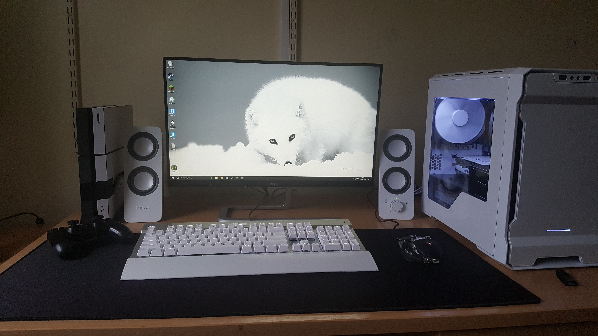

+++
date = '2025-07-25T20:17:00Z'
draft = false
#title = 'About Me'
layout = 'hero'
+++

## About Me

Greetings, I'm Kasonde A. Sefuke but you can call me Kas. I'm a desktop support engineer transitioning to Devops.
I created this blog to document the technologies, tools, and ideas that I’m learning along the way, as well as the things that genuinely interest me.

I've always been a tinkerer, messing with Lego as child, to CAD and CNC software in Secondary School and College.
I has some experience messing with the odd computer here and there throughout my childhood. However, it was only after building my first custom PC back in 2016 that considered pursuing IT as a career.
Since then i've built several PC's, switched to Linux for everything, and built a homelab where I host my own services and experiment with new technologies in a hands on environment.

Outside of tech, I enjoy listening to music and playing the occasionally indie game.

### Beats to listen to
I will be placing a bandcamp card at the end of each article, to give you insight into my music taste.


**ALERT!** - Lower your volume, the embedded bandcamp player doesn't have volume controls and it's quite loud by default.


**Oblique Occasions - Anathema**

The Pinnacle of Barber Beats Tunes
