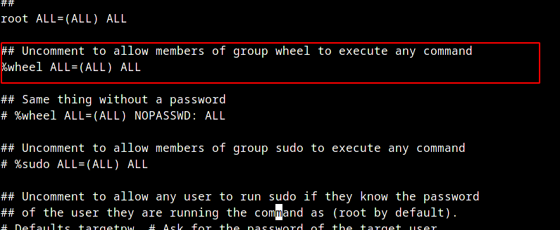

+++
date = '2025-10-25T20:27:30Z'
title = 'Arch Linux Install'
description = 'First time installing Arch Linux'
layoutBackgroundBlur = 'true'
draft = 'false'
+++

I'm no stranger to the linux terminal. I've been daily driving arch linux derivatives like [Manjaro](https://manjaro.org/), [Endeavour OS](https://endeavouros.com/) and recently [Cachy OS](https://cachyos.org/) for almost 4 years now.
But have never really played with the source. Too scared i would miss something crucial in the install and suffer the consequences days later. 
Finally had proper go with assistance from Kubecraft and a spare laptop previously running Pop OS

*Hardware Specs*:
- **Laptop Model**: Dell Latitude E7450
- **CPU**: Intel Core I5 5330u
- **Memory**: 8GB
- **Disk**: Samsung 850 EVO 256GB SSD
- **System Configuration**: UEFI x64 | LVM on LUKS | Systemd-boot | KDE

## Boot Mode
Verifying Boot Mode to confirm UEFI x64 is in use, UEFI x32 has increasingly limited software/boot support and shouldn't be used on hardware newer than 2009/2013. More details available [here](https://wiki.archlinux.org/title/Unified_Extensible_Firmware_Interface#UEFI_firmware_bitness)
```sh
cat /sys/firmware/efi/fw_platform_size
```

## Internet Connectivity
Connected to wlan0 to TPLINK_OC4D via [iwctl](https://wiki.archlinux.org/title/Iwd#iwctl), which manipulates iwd
```sh
iwctl
```
Entered following commands within the interactive prompt to connect to WIFI
```
device list
station wlan0 scan
station wlan0 connect TPLINK_OC4D
exit
```

Verified Internet Connectivity by pinging "ping.archlinux.org" or "station wlan0" in iwctl
```sh
ping ping.archlinux.org
```
Used [timedatectl](https://man.archlinux.org/man/timedatectl.1) to set correct timezone, default setting was an hour behind
```sh
timedatectl list-timezones
timedatectl set-timezone Europe/London
```

System can now be accessed via ssh once a root password is set, default config settings allow root password login
## Disk Partitioning
-  A boot, root and optionally a swap partition need to be created
- Queried visible drives with lsblk
- Used fdisk to partition 1gb for boot partition and set file type to efi, used remaining disk space for second partition for root
```
# fdisk interactive prompt
# m select partition, first and last sector used
# t select file type
# p print out partition layout 
# w confirm and write changes to disk
```

### Encryption 
Following on from kubecraft classroom, i setup full disk encryption including boot partition via [LVM on LUKS](https://wiki.archlinux.org/title/Dm-crypt/Encrypting_an_entire_system#LVM_on_LUKS) using the diagram below as a reference
I would personally setup disk encryption just for the home dir on a personal desktop, limine encryption support will determine if this or full disk encryption will be done

Would do full encryption on a laptop or work installation though

```sh
# Create the LUKS encrypted container at the designated partition. Enter the chosen password twice
cryptsetup luksFormat /dev/sda2 
# Open/Unlock container
cryptsetup open /dev/sda2 cryptlvm
```
## LVM
Using LVM allows for easier management of the drives over formatting drives directly with a filesystem i.e ext4, xfs or btrfs. https://wiki.archlinux.org/title/Dm-crypt/Encrypting_an_entire_system#Preparing_the_logical_volumes
```sh
# Create a physical volume on top of the opened LUKS container
pvcreate /dev/mapper/cryptlvm
# Create a volume group (in this example named `echo`, but it can be whatever you want) and add the previously created physical volume to it:
vgcreate echo /dev/mapper/cryptlvm
# Create all your logical volumes on the volume group
lvcreate -L 4G -n swap echo
lvcreate -L 32G -n root echo
lvcreate -l 80%FREE -n home echo
```

Created required filesystems
```sh
mkfs.ext4 /dev/echo/root 
mkfs.ext4 /dev/echo/home
mkswap /dev/echo/swap
```

Mounted filesystems to chroot folder (don't forget home directory)
```sh
mount /dev/echo/root /mnt
mount --mkdir /dev/echo/home /mnt/home
swapon /dev/echo/swap
```

Configured and mounted boot partition
```sh
mkfs.fat -F32 /dev/sda1
mount --mkdir /dev/sda1 /mnt/boot
```
## System Configuration
Installed [essential packages](https://wiki.archlinux.org/title/Installation_guide#Install_essential_packages) to chroot folder
```sh
pacstrap -K /mnt base linux linux-firmware
```

Used "genfstab" to generate fstab records for booting
```sh
genfstab -U /mnt >> /mnt/etc/fstab
```
Records in "/etc/fstab"
```
# /dev/mapper/echo-root
UUID=b38f1acb-7d94-4afd-84dd-f9af7d41a58e       /               ext4            rw,relatime     0 1

# /dev/sda1
UUID=6451-8F86          /boot           vfat            rw,relatime,fmask=0022,dmask=0022,codepage=437,iocharset=ascii,shortn>

# /dev/mapper/echo-home
UUID=dd9e2e20-bb83-4faa-8f4a-bd67caefd5c6       /home           ext4            rw,relatime     0 2

# /dev/mapper/echo-swap
UUID=c55d8326-4ece-449e-96ef-a2a18d8ee456       none            swap            defaults        0 0
```

Chrooted into install 
```sh
arch-chroot /mnt
```
### Time and localization
Set correct timezone via symlink:
```bash
ln -sf /usr/share/zoneinfo/Europe/London /etc/localtime
```
Used [hwclock](https://man.archlinux.org/man/hwclock.8) to generate /etc/adjtime
```sh
hwclock --systohc
```

Un-commented US and GB locale values in "/etc/locale.gen"  and ran "locale-gen". Copied from Cachyos install (variables pulled from calamere installer)
```
en_GB.UTF-8 UTF-8
en_US.UTF-8 UTF-8
```

Copied Language variables from cachyos "/etc/locale.conf"
```
LANG=en_GB.UTF-8
LC_ADDRESS=en_GB.UTF-8
LC_IDENTIFICATION=en_GB.UTF-8
LC_MEASUREMENT=en_GB.UTF-8
LC_MONETARY=en_GB.UTF-8
LC_NAME=en_GB.UTF-8
LC_NUMERIC=en_GB.UTF-8
LC_PAPER=en_GB.UTF-8
LC_TELEPHONE=en_GB.UTF-8
LC_TIME=en_GB.UTF-8
```

Set console keyboard layout to US in "/etc/vconsole.conf"
```
KEYMAP=us
```

Set hostname to "arch-kubecraft" in "/etc/hostname"
### Networking
Networking in the guide is done with [systemd-networkd](https://wiki.archlinux.org/title/Systemd-networkd) 
```bash
systemctl enable systemd-networkd.service
systemctl enable systemd-resolved.service
```
Created the following file in "/etc/systemd/network/25-wireless-network"
```bash
[Match]
Name=wlan0

[Network]
DHCP=yes
IgnoreCarrierLoss=3s
```

Followed by installing and enabling [iwd](https://wiki.archlinux.org/title/Iwd)
```bash
pacman -S iwd
systemctl enable iwd.service
```

### Configuring mkinitcpio
[mkinitcpio](https://gitlab.archlinux.org/archlinux/mkinitcpio/mkinitcpio) is a Bash script used to create initramfs images, which is a temp root file system used during the boot process of Linux systems, allowing the kernel to load necessary drivers and mount the real root file system
Amended "/etc/mkinitcpio.conf" to include the following:
```
HOOKS=(base **systemd** autodetect microcode modconf kms **keyboard** **sd-vconsole** block **sd-encrypt** **lvm2** filesystems fsck)
```
Regenerated initarmfs with "mkinitcpio -P" after making sure "linux and lvm2 were installed.

### Bootloader
*Insert post > BIOS > Bootloader* picture
What is a bootloader
Systemd loader needs to reference a file which contains the linux kernel (vmlinuz-linux) and initramfs-linux.img generated by mkinitpcio

As of 23/10/25 bootctl needs to run outside chroot to work properly
```bash
bootctl --esp-path=/mnt/boot install
arch-chroot /mnt
bootctl install
```


/boot/loader/entries/arch.conf template with decryption instructions taken from [wiki](https://wiki.archlinux.org/title/Dm-crypt/Encrypting_an_entire_system#Configuring_the_boot_loader_2) 
```
title   Arch Linux
linux   /vmlinuz-linux
initrd  /initramfs-linux.img
options rd.luks.name=device-UUID=cryptlvm(or MyVolgroup name if renamed) root=/dev/MyVolGroup/root rw
```

My file which references the root encrypted container device lvm is deployed on top of (i.e /dev/sda2) pulled via "blkid", and the root directory within the lvm volumes
```
title   Arch Linux
linux   /vmlinuz-linux
initrd  /initramfs-linux.img
options rd.luks.name=163bdea6-6c73-4708-a6f4-848c4fdfb4eb=echo root=/dev/echo/root rw
```


### Normal User Creation
Created a "echo" user via useradd and give it sudo permissions and a password. User -m argument to autocreate home directory
```bash
useradd -m echo
usermod -aG wheel echo
passwd echo
```
Uncomment %wheel ALL=(ALL) ALL from sudo file with "EDITOR= visudo"


Verify sudo is working with normal user
```bash
su - echo
id
sudo whoami
```


## Desktop Environment
I would personally use a window manager like [hyprland](https://hypr.land/), but installed the [KDE](https://wiki.archlinux.org/title/KDE) desktop environment for simplicity
```bash
sudo pacman -Syu # Updates mirrors and installed packages
sudo pacman -S plasma-meta sddm # Installs KDE deskop environment 
sudo pacman -S sddm # Installs SDDM (Graphical Login Program)
sudo systemctl enable sddm.service # Set sddm to launch on system startup
sudo systemctl start sddm.service # Starts sddm 
```


## Additional Goals for Setup
I'm quite comfortable with cachy os on my main rig using [Limine Bootloader](https://codeberg.org/Limine/Limine) and BTRFS filesystem for native snapshots support while booting (absolute lifesaver). But i do have a couple of things i would want to try on a new installation:
- Limine boot support for secure boot and encrypted btrfs subvolumes
- Reflector script to update package repo's with fatest sources
- Learn vim
- Frequently investigating results of arch-audit
- Considering blacklisting certain files from BTRFS/ZFS Snapshot to preventing mismanagement of [sensitive data](https://wiki.archlinux.org/title/Security#Snapshots) snapshot 
- Test Install of minimal fedora with [Cachy OS optimizations](https://blog.mtaha.dev/performance/fedora_linux_performance_tuning)

## Beats to listen to


**ALERT!** - Lower your volume, the embedded bandcamp player doesn't have volume controls and it's quite loud by default.


**A.L.I.S.O.N - Derniere Ride**

Perfect tune to match the chaos and pandemonium of R4E1 Runs (If you know, you know. If not, be greatful)


