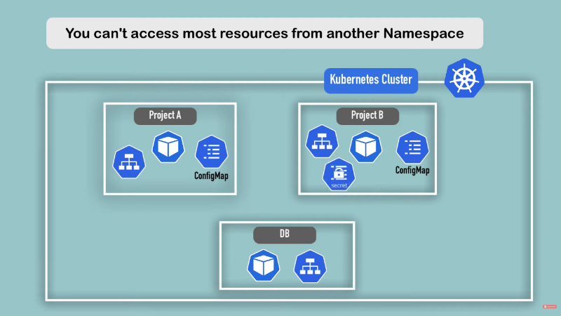
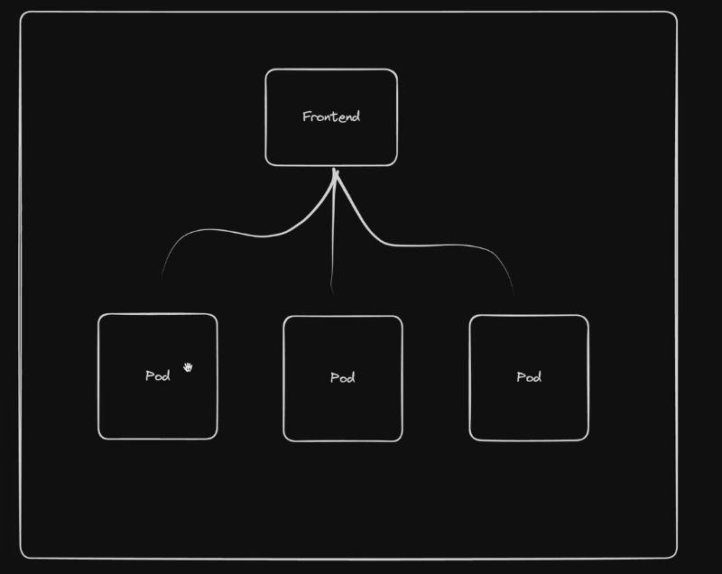

+++
date = '2025-12-25T20:27:30Z'
title = 'DevOps Part 1 - K8s Fundamentals'
draft = false
+++
This article outlines my understanding of kubernetes fundamentals and principles as they arise, i'm likely to update this article over time as my knowledge grows.


---
## Control Plane
The control plane is the brain of a kubernetes cluster. It's a collection of components that manage the cluster's state, make scheduling decisions, and respond to cluster events. In addition to continuously verifying the desired state of the cluster matches it's actual state. Responsibilities include:
- Maintaining cluster state in etcd
- Scheduling workloads across nodes
- Detecting and responding to cluster events (pod crashes, node failures)
- Exposing the Kubernetes API
- Handling authentication and authorisation
---
### ETCD
[ETCD](https://kubernetes.io/docs/concepts/architecture/#etcd) is a consistent and highly-available key value store used as Kubernetes' backing store for all cluster data.

### API Server
An API Server functions as the front door for the control plane and is responsible for the following:
- Serving as the Kubernetes REST API on port 6443 (HTTPS)
- Communicates directly ETCD, the clusters database which functions as key value store for all API Server Data.
- Validates and processes all API requests from kubectl, other control plane components, and cluster nodes
- Gateway for all cluster operations i.e creating pods, services, deployments, etc.
- Handles authentication and authorisation, and makes the authenticated user available via the request context.
- Implements admission control (validating and potentially modifying requests)
#### Context 
A context is a configuration that defines which cluster you're connecting to and how you're authenticated when using kubectl or other Kubernetes tools. 
A context bundles together three pieces of information:
1. **Cluster** - The Kubernetes API server endpoint (URL and certificate data)
2. **User** - Authentication credentials (certificates, tokens, or auth provider config)
3. **Namespace** - The default namespace for commands (optional)

<details>
<summary>Context file example with 2 clusters</summary>

```yaml
apiVersion: v1
kind: Config
current-context: prod-cluster

# Clusters - Define the Kubernetes API server endpoints
clusters:
  - name: prod-cluster
	cluster:
      certificate-authority-data: LS0tLS1CRUdJTiBDRVJUSUZJQ0FURS0tLS0tCk1JSURCVENDQWUyZ0F3SUJBZ0lJcHJv...
      server: https://prod-k8s-api.example.com:6443
  
  - name: minikube
    cluster:
      certificate-authority: /home/user/.minikube/ca.crt
      server: https://127.0.0.1:8443

# Users - Define authentication credentials
users:
  - name: prod-admin
    user:
      client-certificate: /path/to/prod-admin.crt
      client-key: /path/to/prod-admin.key

  - name: minikube-user
    user:
      client-certificate: /home/user/.minikube/profiles/minikube/client.crt
      client-key: /home/user/.minikube/profiles/minikube/client.key


# Contexts - Combine cluster, user, and namespace
contexts:
  - name: prod-cluster
    context:
      cluster: prod-cluster
      user: prod-admin
      namespace: default

  - name: minikube
    context:
      cluster: minikube
      user: minikube-user
      namespace: default

preferences: {}
```
</details>

### Scheduler
The scheduler is responsible for assigning newly created pods to nodes within the cluster. Variables such CPU/RAM/Storage availability or requirement scan be to defined to automate pod assignment on selected nodes.

---
## Pods
Pods or Pod of whales are the smallest element of a kubernetes cluster.
A Pod is not a container but a collection of containers and other services, types of services defined in pod config include :
- **Single Container** - Single container pod
- **Multicontainer** - I.e service + database for service
- **Initcontainer** - Essentially a container version of the docker compose "depends on" variable, which checks if a required resource such as a PSQL database is running/reachable before initialising other containers in a pod.
- **Networking** - Subnet, IP, access policies
- **Storage** - What type of storage is provisioned for the Pods i.e persistent, non-persistent, network share.

<details>
<summary>Stats of a pod can be displayed via kubectl describe</summary>

```sh
Name:             nginx-echo
Namespace:        default
Priority:         0
Service Account:  default
Node:             lima-rancher-desktop/192.168.5.15
Start Time:       Sun, 14 Dec 2025 22:50:03 +0000
Labels:           run=nginx-echo
Annotations:      <none>
Status:           Running
IP:               10.42.0.39
IPs:
  IP:  10.42.0.39
Containers:
  nginx-echo:
    Container ID:   docker://d4d13de076b1e6337dbc40e17fa92676f7480344c9d7d33b54311be2df60cad9
    Image:          nginx
    Image ID:       docker-pullable://nginx@sha256:fb01117203ff38c2f9af91db1a7409459182a37c87cced5cb442d1d8fcc66d19
    Port:           <none>
    Host Port:      <none>
    State:          Running
      Started:      Sun, 14 Dec 2025 22:50:07 +0000
    Ready:          True
    Restart Count:  0
    Environment:    <none>
    Mounts:
      /var/run/secrets/kubernetes.io/serviceaccount from kube-api-access-cmhwk (ro)
Conditions:
  Type                        Status
  PodReadyToStartContainers   True
  Initialized                 True
  Ready                       True
  ContainersReady             True
  PodScheduled                True
Volumes:
  kube-api-access-cmhwk:
    Type:                    Projected (a volume that contains injected data from multiple sources)
    TokenExpirationSeconds:  3607
    ConfigMapName:           kube-root-ca.crt
    Optional:                false
    DownwardAPI:             true
QoS Class:                   BestEffort
Node-Selectors:              <none>
Tolerations:                 node.kubernetes.io/not-ready:NoExecute op=Exists for 300s
                             node.kubernetes.io/unreachable:NoExecute op=Exists for 300s
Events:
  Type    Reason     Age   From               Message
  ----    ------     ----  ----               -------
  Normal  Scheduled  62s   default-scheduler  Successfully assigned default/nginx-echo to lima-rancher-desktop
  Normal  Pulling    62s   kubelet            Pulling image "nginx"
  Normal  Pulled     58s   kubelet            Successfully pulled image "nginx" in 3.663s (3.663s including waiting). Image size: 59795293 bytes.
  Normal  Created    58s   kubelet            Created container: nginx-echo
  Normal  Started    58s   kubelet            Started container nginx-echo
```
</details>

---
### Pods as YAML
Pods will typically be deployed from yaml files vs being deployed directly via kubectl where pod config paramater aren't initially displayed, and the pod is run with default parameters designated by the image dev/maintainer.
Output of "kubectl run nginx --image=nginx --dry-run=client -o yaml"
```yaml
apiVersion: v1
kind: Pod
metadata:
  labels:
    run: nginx
  name: nginx
spec:
  containers:
  - image: nginx
    name: nginx
    resources: {}
  dnsPolicy: ClusterFirst
  restartPolicy: Always
status: {}
```
The `dry-run=client` options allows the default parameters to be printed as yaml text in the terminal without submitting the pod request to the server. If server is set instead of client, then the pod request is submitted as a server-side request without persisting the resource.
Adding > `<filename>.yaml` to the end of`kubectl run nginx --image=nginx --dry-run=client -o yaml` outputs it to a yaml file in your current directory
In addition to dry-run, yaml templates can also be obtained from [kubernetes.io documentation](https://kubernetes.io/docs/concepts/workloads/pods/)
![[image-31.png|345x277]]
### Deploying resources using kubectl
Resources can be applied using kubectl apply and kubectl create. Apply is better to use as it:
- Creates the resource if it doesn't exist, or updates it if it does
- Declarative approach - describes desired state
- Tracks the last applied configuration as an annotation
- Enables incremental updates and three-way merge
- Recommended for managing resources long-term
- Example: `kubectl apply -f deployment.yaml`

Whereas kubectl create:
- Creates a new resource from scratch
- Fails if the resource already exists
- Is a one-time imperative operation
- Doesn't track configuration history
- Example: `kubectl create -f deployment.yaml`

### Interacting with Pods

Once pods are running it is important to be able to interact with their contents for troubleshooting, investigation and modification purposes
This can be accomplished with `kubectl exec -it <pod-name> -- <shell>` i.e `kubectl exec -it nginx-pod -- /bin/bash`.
Changes to pods can be monitored in realtime using `watch -n 1 "kubectl get pods`
### Defining Environmental Variables for containers
[kubernetes.io - Container Env Variables](https://kubernetes.io/docs/tasks/inject-data-application/define-environment-variable-container/#define-an-environment-variable-for-a-container)

- **env** - allows you to set environment variables for a container, specifying a value directly for each variable that you name.

- **envFrom** - allows you to set environment variables for a container by referencing either a ConfigMap or a Secret. When you use `envFrom`, all the key-value pairs in the referenced ConfigMap or Secret are set as environment variables for the container. You can also specify a common prefix string

---
## Deployments
[kubernetes.io - Deployments](https://kubernetes.io/docs/concepts/workloads/controllers/deployment/)

A Deployment manages a set of Pods to run an application workload.
Pods are not usually run in the individually. They are provisioned as part of deployments which provides more configurable variables that will be built upon later.


<details>

<summary>Output of kubectl create deployment nginx-deploy --image=nginx --dry-run=client -o yaml > nginx-deploy.yaml</summary>

```yaml
apiVersion: apps/v1
kind: Deployment
metadata:
  labels:
    app: nginx-deploy
  name: nginx-deploy
spec:
  replicas: 10
  selector:
    matchLabels:
      app: nginx-deploy
  strategy: {}
  template:
    metadata:
      labels:
        app: nginx-deploy
    spec:
      containers:
      - image: nginx
        name: nginx
        resources: {}
status: {}
```
</details>

Deployments ships with the "RollingUpdate" strategy by default, which determines the minimum and maximum number of pods that need to be available while a deployment update is being rolled out.
```yaml
 strategy:
    rollingUpdate:
      maxSurge: 25%
      maxUnavailable: 25%
    type: RollingUpdate
```

RollingUpdate Deployments support running multiple versions of an application at the same time. When you or an autoscaler scales a RollingUpdate Deployment that is in the middle of a rollout (either in progress or paused), the Deployment controller balances the additional replicas in the existing active ReplicaSets (ReplicaSets with Pods) in order to mitigate risk. This is called[ _proportional scaling_](https://kubernetes.io/docs/concepts/workloads/controllers/deployment/#proportional-scaling).

In the event that an update causes pods within a deployment to error out or crash loop, kubernetes is smart enough to rollback changes.

---
## Namespaces
[kubernetes.io - Namespaces](https://kubernetes.io/docs/concepts/overview/working-with-objects/namespaces/)

Namespaces are a mechanism for isolating groups of resources within a single cluster, think of namespaces like virtual clusters.
They are typically used to separate resources the following:
- **Security** - Restrict access and resource limits on namespaces, manage ACLs for projects with many users or general security. Hardware Resource like Storage, CPU and RAM can also be restricted
- **Maintenance** - Separate apps and there required resources into their own namespace for hygiene and ease of maintenance. i.e Namespace for a database + it's required resources, a monitoring namespace for Grafana + Prometheus, Namespace for nginx-ingress + all it's resources
- **Management** - Different namespaces for Production, development and staging. Prevent accidental overlapping of changes to resources by other users in the same namespace. in addition to sharing services between different environments

Kubernetes provides 4 namespaces by default. Output of `kubectl get namespaces`
```bash
NAME              STATUS   AGE
default           Active   10d # Default namespace for user created resources if a new namespace isn't specified
kube-node-lease   Active   10d # Heartbeats of nodes, each node has associated lease object in namespace. Determines availability of a node
kube-public       Active   10d # Contains publicly accessible data. i.e configmap (contains cluster information)
kube-system       Active   10d # Namespaces for managing system processes, Master and Kubectl processes. Shouldn't be modified or used for user generated resources
```
Namespaces can be created via CLI using `kubectl create namespace my-namespace`, `kubectl apply -f configmap.yaml --namespace mynamespace` or via declaring a namespace in a config file.
```yaml
apiVersion:v1
kind: ConfigMap
metadata:
	name: mysql-configmap
	namespace: my-namespace
data:
db_url: mysql-service.database
```
**Tips**:
- Some components can't be created in a namespace, these are typically components which live globally in a cluster and or can't be isolated. i.e Nodes and Volumes (persistent volumes).
- Active namespace can be changed using kubens, which needs to be installed separately from kubectl. `kubens my-namespace`
- Namespace can also be changed using `kubectl config set-context --current --namespace=<namespace-name>`.
- Deleting a namespace will delete the resources inside it
- Most resources from another namespace can't be accessed. Each Namespace must define it's own configmap i.e Project A and Project B NSs must include a reference to a Database in DB NS to access it

- Services in another namespace can be accessed if the namespace is included in the url.
```yaml
data:
db_url: mysql-service.database
```

---
## Networking
---
### Pods
- Networking on Pod Level
- Each pod gets it's own IP address
- Pods can connect to all pods on all nodes by default
- Traffic between pods can be adjusted with network policies
- Containers in pods can communication with each other through localhost
- IPs can be listed with `kubectl get pods -o wide`
- Pods can't be assigned the same port number

---
### Container Networking Interface - CNI Plugin
- Imagine a CNI as a physical network adapter
- Provides network Connectivity to the containers
- Configure network interfaces in containers
- Assigns IP addresses and sets up routes > IPTables on nodes
- Examples of CNIs: Calico, Cillium and Flannel

The running CNI can found for rancher desktop via lt's `/etc/cni/net.d/` after launching a interactive bash shell for rancher via `rdctl shell bash`.


<details>

<summary>Output of cat "/etc/cni/net.d/flannel.conflist"</summary>

```json
	{
  "name":"cbr0",
  "cniVersion":"0.3.1",
  "plugins":[
    {
      "type":"flannel",
      "delegate":{
        "hairpinMode":true,
        "forceAddress":true,
        "isDefaultGateway":true
      }
    },
    {
      "type":"portmap",
      "capabilities":{
        "portMappings":true
      }
    }
  ]
}
```
</details>

---
### Services
Offers a consistent address to access a set of pods:
- Pods are ephemeral, they shouldn't be expected to have a long lifespan
- Pods are constantly be moved across nodes and changing
- The system needs a way to keep track of the constantly changing IPs
- Service can act as the frontend for a group of pods and balance traffic during rolling updates

- List of services can be queried with `kubectl get service -o wide`
- Can be declared as code or CLI via `kubectl expose deploynent frontend --port <port number>`
- Service uses metadata > labels > app field to identify which pods to target
```yaml
metadata:
  labels:
    app: frontend
  name: frontend
```

Output of kubectl get service -o wide
```bash
NAME       TYPE        CLUSTER-IP     EXTERNAL-IP   PORT(S)    AGE   SELECTOR
frontend   ClusterIP   10.43.50.156   <none>        8080/TCP   21s   app=frontend
```
The cluster IP the service generates is static and can be resolved alongside the service name, to target all of the pods behind the frontend and load balance the traffic between those pods thanks to kubernetes internal dns (coredns).

Code for services can be pulled via `kubectl get svc $service-name -o yaml > service.yaml`
### Types of services
- **ClusterIP** - Creates cluster-wide IP for the service (Default Service)
- **NodePort** - Exposes a port on each node allowing direct access to the service through any node's IP address (Like the docker host network?). Feels insecure
- **LoadBalancer** - used for cloud providers, will create an azure loadbalancer (AKS) to route traffic into the cluster. Can also be used in k3s/rancher desktop

---
### Ingress
Ingress exposes HTTP and HTTPS routes from outside the cluster to services within the cluster, implemented by **[Ingress Resource (YAML)](https://jamesdefabia.github.io/docs/user-guide/ingress/)**
Feature set includes SLL/TLS Termination, External URLS and Path based routing.
Example of route:
ld.ksefuke-labs.com > Ubound DNS (OPNsense) > Kubernetes Loadbalancer (Created by Traefik/NGINX port 80/443) > Ingress > Routing Rule > Service > Pod/Pods

The Traefik SVC deployed in the kube-system namespace (Rancher Desktop) is set as a loadbalancer
```bash
❯ k get svc
NAME             TYPE           CLUSTER-IP    EXTERNAL-IP    PORT(S)                      AGE
kube-dns         ClusterIP      10.43.0.10    <none>         53/UDP,53/TCP,9153/TCP       11d
metrics-server   ClusterIP      10.43.4.243   <none>         443/TCP                      11d
traefik          LoadBalancer   10.43.7.68    192.168.5.15   80:31900/TCP,443:30922/TCP   11d
```
#### Available ingress controller
- [**Azure Application Gateway Ingress Controller (AGIC)**](https://azure.github.io/application-gateway-kubernetes-ingress/) - an ingress controller that can be run on Azure Kubernetes Service (AKS) to allow an Azure Application Gateway to act as the ingress for an AKS cluster.
- **[Cilium](https://cilium.io/use-cases/ingress/)** - Cillium Ingress
- [**Nginx**](https://github.com/kubernetes/ingress-nginx) - Ingress NGINX Controller for Kubernetes
- [**Traefik** ](https://doc.traefik.io/traefik/reference/install-configuration/providers/kubernetes/kubernetes-ingress/) - Traefik Kubernetes Ingress provider (Rancher Default)
Available controllers can queried with `kubectl get ingressclasses.networking.k8s.io` which is traefik in for k3s and rancher desktop
```bash
NAME      CONTROLLER                      PARAMETERS   AGE
traefik   traefik.io/ingress-controller   <none>       22d
```

Ingress example for Linkding
```yaml
apiVersion: networking.k8s.io/v1
kind: Ingress
metadata:
  name: linkding
  namespace: linkding
spec:
  ingressClassName: traefik
  rules:
    - host: lds.example.com
      http:
        paths:
          - backend:
              service:
                name: linkding
                port:
                  number: 9090
            path: /
            pathType: Prefix
```
---
## Security

---
### Security Context
[Kubernetes.io - Security Context](https://kubernetes.io/docs/tasks/configure-pod-container/security-context/)

Most containers by default run as the root user inside and outside of container, which is an ill advised practise as attackers can run commands inside and outside of the container and potentially escalate privileges.

Linkding with the current image in use `ghcr.io/sissbruecker/linkding:1.44.2-plus-alpine`  runs as root, packages such as curl and nmap can be installed

The easiest way to secure containers is with security context, but info about the default user inside the container needs to be identified.

Output of cat `/etc/passwd` inside linkding container shell
```txt
root:x:0:0:root:/root:/bin/sh
bin:x:1:1:bin:/bin:/sbin/nologin
daemon:x:2:2:daemon:/sbin:/sbin/nologin
lp:x:4:7:lp:/var/spool/lpd:/sbin/nologin
sync:x:5:0:sync:/sbin:/bin/sync
shutdown:x:6:0:shutdown:/sbin:/sbin/shutdown
halt:x:7:0:halt:/sbin:/sbin/halt
mail:x:8:12:mail:/var/mail:/sbin/nologin
news:x:9:13:news:/usr/lib/news:/sbin/nologin
uucp:x:10:14:uucp:/var/spool/uucppublic:/sbin/nologin
cron:x:16:16:cron:/var/spool/cron:/sbin/nologin
ftp:x:21:21::/var/lib/ftp:/sbin/nologin
sshd:x:22:22:sshd:/dev/null:/sbin/nologin
games:x:35:35:games:/usr/games:/sbin/nologin
ntp:x:123:123:NTP:/var/empty:/sbin/nologin
guest:x:405:100:guest:/dev/null:/sbin/nologin
nobody:x:65534:65534:nobody:/:/sbin/nologin
www-data:x:82:82::/home/www-data:/sbin/nologin
```

And can also be found with 
```bash
kubectl logs linkding-cd44b7c4-2x5sl | grep "id"
```

Looks like the default user 82, this isn't a typical linux user. Looking at the Linkding alpine [Dockerfile](https://github.com/sissbruecker/linkding/blob/master/docker/alpine.Dockerfile) also confirms this:
**Line 55 - 57**
```Dockerfile
RUN set -x ; \
  addgroup -g 82 -S www-data ; \
  adduser -u 82 -D -S -G www-data www-data && exit 0 ; exit 1
```
**Line 113 - 115**
```Dockerfile
RUN mkdir -p chromium-profile &&  \
    chown -R www-data:www-data chromium-profile &&  \
    chown -R www-data:www-data uBOLite.chromium.mv3
```

Applied spec and container security context to deployment
```yaml
apiVersion: apps/v1
kind: Deployment
metadata:
  name: linkding
spec:
  replicas: 1
  selector:
    matchLabels:
      app: linkding
  template:
    metadata:
      labels:
        app: linkding
    spec:
      securityContext:
        fsGroup: 82 # Makes all files created in mounted volumes owned by group ID 82 
                    # and sets the setgid bit on directories
        runAsUser: 82 # Forces the container process to run as user ID 82
        runAsGroup: 82 # Sets the primary group ID to 82 for all processes in the container

      containers:
      - image: ghcr.io/sissbruecker/linkding:1.44.2-plus-alpine
        name: linkding
        ports: 
          - containerPort: 9090

        securityContext:
            allowPrivilegeEscalation: false # Stops processes gaining more privileges than 
                                            # their parent process
```

---
## Storage
[Kubernetes.io - Storage](https://kubernetes.io/docs/concepts/storage/)

Storage in kubernetes is a way to provide long-term and temporary storage to pods in a cluster.
Kubernetes doesn't provide persistent storage out of the box, pods will use ephemeral storage if persistent storage isn't provisioned and declared. Meaning the data generated in pods will be lost if they are stopped/recreated/deleted.

Production grade persistent storage on kubernetes needs to meet these requirements:
1. isn't dependent on the pod life cycle
2. Must be available on all nodes
3. Needs to survive a cluster crash
A database pod for an app in a deployment is good example of a workload that requires resilient persistent storage.
Another use case for persistent storage is an app that need to read/write to an existing directory i.e config files, logs, session files.

---
### Ephemeral Volumes
Are volumes which follow a Pod's lifetime and get created and deleted along with the Pod. Allowing pods to be stopped and restarted without being restricted by the availability of storage

Examples of ephemeral volumes include:
- [emptyDir](https://kubernetes.io/docs/concepts/storage/volumes/#emptydir) - empty at Pod startup, with storage coming locally from the kubelet base directory (usually the root disk) or RAM
- [configMap](https://kubernetes.io/docs/concepts/storage/volumes/#configmap) and [secret](https://kubernetes.io/docs/concepts/storage/volumes/#secret) - inject different kinds of Kubernetes data into a Pod
- [image](https://kubernetes.io/docs/concepts/storage/volumes/#image) - allows mounting container image files or artifacts, directly to a Pod.
- [generic ephemeral volumes](https://kubernetes.io/docs/concepts/storage/ephemeral-volumes/#generic-ephemeral-volumes) - which can be provided by all storage drivers that also support persistent volumes

#### emptyDir Example
Example nginx config
```yaml
apiVersion: v1
kind: Pod
metadata:
  labels:
  name: nginx-storage
spec:
  containers:
  - image: nginx
    name: nginx
    volumeMounts:
      - mountPath: /scratch
        name: scratch-volume
  volumes:
     - name: scratch-volume
     emptyDir:
      sizeLimit: 500Mi
```

`kubectl describe and exec -it -- /bin/bash` into the pod reveal the container is now using EmptyDir scratch volume mounted at /scratch as specified in the config above.

```txt
Volumes:
  scratch-volume:
    Type:       EmptyDir (a temporary directory that shares a pod's lifetime)
    Medium:
    SizeLimit:  500Mi
```

```bash
root@nginx-storage:/# ls
bin  boot  dev	docker-entrypoint.d  docker-entrypoint.sh  etc	home  lib  lib64  media  mnt  opt  proc  root  run  sbin  scratch  srv	sys  tmp  usr  var
```

Nginx + Busybox pod mounted to the same volume (busybox pod requires running commands to function)
```yaml
apiVersion: v1
kind: Pod
metadata:
  labels:
  name: nginx-storage
spec:
  containers:
  - image: nginx
    name: nginx
    volumeMounts:
      - mountPath: /scratch
        name: scratch-volume
  - image: busybox
    name: busybox
    command: ["/bin/sh", "-c"] # Run this binary in none interactive mode
    agrs: ["sleep 1000"] # Sleep for 1000 seconds
    volumeMounts:
      - mountPath: /scratch
        name: scratch-volume       
  volumes:
    - name: scratch-volume
      emptyDir:
       sizeLimit: 500Mi
```

With 2 containers inside the pod now standard kubectl exec - it won't work, the "-c or --container" option needs to be added and the specific container defined:
```bash
kubectl exec - it nginx-storage -c busybox -- /bin/sh
```
##### Errors
"The Pod "nginx-storage" is invalid: spec.containers: Forbidden: pod updates may not add or remove containers" - Kubernetes doesn't allow modifying the containers in an existing pod. The pod needs to be deleted or recreated.

 i also got this error when applying the yaml file above  "strict decoding error: unknown field "spec.containers[1].agrs"". The best solution i have found is to search the [kubernete-api](https://kubernetes.io/docs/reference/kubernetes-api/). Which in regards to this error follows these workflow: 

1. [Workload Resources](https://kubernetes.io/docs/reference/kubernetes-api/workload-resources/) - Objects that manage the creation, scaling, and life cycle of pods.
2. [Pod ](https://kubernetes.io/docs/reference/kubernetes-api/workload-resources/pod-v1/#Pod) - identified via "kind: Pod" in the config file
3. [Spec](https://kubernetes.io/docs/reference/kubernetes-api/workload-resources/pod-v1/#PodSpec) - The specifications of the desired behaviour of a pod.
4. Container[1] - The no of the container, count starts at 0 so this is referring to the second container (busybox)
5. Entrypoint > Args (Was a typo....😔)
---
### Persistent Volume (PV) 
A PV can be treated as a cluster resource (Like CPU/RAM) which is used to storage data or an external plugin to the cluster. A PV can be statically or dynamically provisioned. Static provisioning means the PV was provisioned by a K8 admin. 

Dynamic provisioning means a volume is dynamically provisioned by the cluster with the aid of a storage class configured by a K8 admin.
PVs needs to be available before pods that depend on them are created.
PVs exist outside of namespaces and are accessible to the whole cluster if restrictions aren't enforced

It is require physical storage such as:
- Local disk on cluster nodes
- External ISCI/NFS Server outside of the cluster
- Cloud Storage - AWS, Azure, Block Storage


**NOTE** - It is worth mentioning that local volume types violate 2. and 3. requirements mention earlier  for data persistence as they are tied a specific node and won't survive a cluster crash.


Persistent Volumes are just an abstraction layer for connecting to the types of physical storage and doesn't have any governance over the storage mediums themselves. So the storage mediums will need to configured and managed manually. App Deployments are restricted to one method of physical storage.
PVs are declared in yaml with the following parameters below with differing spec attributes:

Local Storage
```yaml
apiVersion: v1
kind: PersistentVolume
metadata:
  name: example-pv
spec:
  capacity:
    storage: 100Gi
  volumeMode: Filesystem
  accessModes:
  - ReadWriteOnce
  persistentVolumeReclaimPolicy: Delete
  storageClassName: local-storage
  local:
    path: /mnt/disks/ssd1
  nodeAffinity:
    required:
      nodeSelectorTerms:
      - matchExpressions:
        - key: kubernetes.io/hostname
          operator: In
          values:
          - example-node
```
NFS Storage
```yaml
apiVersion: v1
kind: PersistentVolume
metadata:
  name: pv-name
spec: # How much storage?
	Capacity:
	  storage: 5Gi
	VolumeMode: Filesystem
	accessModes:
		- ReadWriteOnce
	persistentVolumeReclaimPolicy: Recycle # Additional Parameters
	storageClassName: slow
	mountOptions:
		- hard
		- nfsvers=4.0
	nfs: # NFS Parameters
	   path: /dir/path/on/nfs/server
	   server: nfs-server-ip-address
```

Google Cloud
```yaml
apiVersion: v1
kind: PersistentVolume
metadata:
  name: test-volume
  labels:
	failure-domain.beta.kubernetes.io/zone: us-central1-a__central1-b
spec: # How much storage?
  Capacity:
	storage: 400Gi
	accessModes:
	- ReadWriteOnce 
	gcePersistentDisk: # Google Cloud Additional Parameters
		pdName: my-data-disk
		fsType: ext4
```
More examples available here [Kubernetes.io - Volume Types](https://kubernetes.io/docs/concepts/storage/volumes/#volume-types)

Provisioned storage classes can be queried with `kubectl get storageclasses.storage.k8s.io`
```bash
❯ kubectl get storageclasses.storage.k8s.io
NAME                   PROVISIONER             RECLAIMPOLICY   VOLUMEBINDINGMODE      ALLOWVOLUMEEXPANSION   AGE
local-path (default)   rancher.io/local-path   Delete          WaitForFirstConsumer   false                  13d
```
---
### Persistent Volume Claim (PVC)
A component that claims a volume with declared attributes (capacity and access type) and allocates to a designated pod.
"Pod request volume through PV claim" > "Claim tries to find a volume in the cluster" > "Volume (WIth actual storage backend) is mounted into the pod"

PVC config
```yaml
kind: PersistentVolumeClaim
metadata:
  name: pvc-name
spec:
  storageClassName: manual
  volumeMode: Filesystem
  accessModes:
	  - ReadWriteOnce
  resources:
	requests:
	  storage: 10Gi
```

Pod Config Example with PVC attached
```yaml
apiVersion: v1
kind: Pod
metadata:
  name: mypod
spec:
  containers:
	- name: myfrontend
	  image: nginx
	  volumeMounts:
	  - mountPath: "/var/www/html"
	    name: mypd
  volumes:
    - name: mypd
      persistentVolumeClaim: # PVC Claim above
	      claimName: pvc-name

```
**NOTE - Claims must in the same namespace as the pod!**
### Reason For Layers of abstraction
Abstraction between PVs and PVCs allows for better separation of cluster resources between K8 admins provisioning PVs and developers creating claims to provisioned PVs for application storage. As long as the correct type of PV is provisioned developers typically don't concern themselves with much else.

---
### Storage Classes
[Kubernetes.io - Storage Classes](https://kubernetes.io/docs/concepts/storage/storage-classes)

Blueprints for dynamically provisioning PVs on demand with varying performance characteristics, availability guarantees, and provisioning policies.


```yaml
apiVersion: storage.k8s.io/v1
kind: StorageClass
metadata:
  name: local-storage
provisioner: kubernetes.io/no-provisioner # indicates that this StorageClass does not support automatic provisioning
volumeBindingMode: WaitForFirstConsumer
```

---
### ConfigMaps and Secrets
Local Volumes managed by kubernetes which aren't created via PV and PVC, they are designed to pass:
- Config files for a pod/container
- Certificates file for a pod/container
- Storage of credentials, 
They are created via a Secret/ConfigMap component and mounted into a pod/container in the same manner as a PVC
---
## Helm 
[Helm](https://helm.sh/) is basically a package manager for kubernetes like apt, yum and brew. it is used to package yaml.files and distribute them in public and private repos.
 The yaml files charts contain all the parameters required for a App to run. below are the parameters an elastic stack would need to run:
- **Stateful Set** - For stateful apps like DBs
- **ConfgMap** - For external configuration
- **Secret** - For Secret data
- **K8s** - User with permissions
- **Services** - Method of exposing applications i.e ClusterIP, NodePort, LoadBalancer
Public Repo: [Artifacthub.io](https://artifacthub.io/packages/search?kind=0)
Without Helm these yaml parameters would have to be manually researched, tested and written.

---
### Templating
Helm also function as a templating engine, allowing you to create a common blueprint for microservices with similar parameters. In addition to dynamic values with placeholders that can be replaced via a values.yaml override. This method of templating is very practical for CI/CD.

Template Yaml Config
```yaml
apiVersion: v1
kind: Pod
metadata:
	name: {{ .Values.name }}
spec:
  containers:
  - name: {{.Values.name }}
    image: {{ .Values.container.image}}
    port: {{ .Values.container.port}}
```
values.yaml
```yaml
name: my-app
container: my-app-container
  name: my-app-container
  image: my-app-image
  port: 9001
```

Deploying the same applications across different environments is also another use case for helm
A chart can be written that allows a applications to be deployed within different clusters (Development, Staging, Production) using one command


---
### Helm Chart Structure
1. **chart**- Top level folder = Name of chart
2. **Chart.yaml** - Meta info about chart i.e name, dependencies and version
3. **values.yaml** - Contain default values for the template files that can be overridden
4. **charts/** - Folder with chart dependencies
5. **templates/** - Location of actual template files

```yaml
chart/
  chart.yaml
  values.yaml
  charts/
  templates/
```
Once `helm install <chartname>` is executed the placeholder values in the template files will be replaced with values declared in values.yaml.
An alternative values.yaml file can be injected into the template file with `helm install/upgrade--values=my-values.yaml <chartname>`

values.yaml
```yaml
imagename: myapp
port: 8080
version: 1.0.0
```
my-values.yaml
```yaml
version: 2.0.0
```
result after injection of "my-values.yaml"
```yaml
imageName: myapp
port: 8080
version: 2.0.0
```

Values can also be injected via the CLI `helm install --set version=2.0.0`

---
### Release Management
In helm version 2, helm was comprised of 2 components:
**Helm cli** - CLI binary for executing helm commands
**Tiller** - Server installed on K8s cluster which executes helms request and keeps a record of chart executions (copies of configurations, helm updates/rollbacks, creation/deletion).
As of helm version 3, Tiller has been removed due to having too much power inside a K8s cluster (Can create, update and delete charts).

---
## Tools
Useful tools I've discovered

---
### K9S
https://k9scli.io/
Terminal based UI designed to interact with kubernete clusters, it make it easier to navigate, observe and manage your deployed applications


---
### Kubectx and Kubens
https://github.com/ahmetb/kubectx?tab=readme-ov-file

Kubectx is a CLI for quickly switching between contexts (cluster)
```bash
# switch to another cluster that's in kubeconfig
$ kubectx minikube
Switched to context "minikube".

# switch back to previous cluster
$ kubectx -
Switched to context "oregon".

# rename context
$ kubectx dublin=gke_ahmetb_europe-west1-b_dublin
Context "gke_ahmetb_europe-west1-b_dublin" renamed to "dublin".
```

Kubens is a CLI tool for quickly switching between namespaces
```bash
# change the active namespace on kubectl
$ kubens kube-system
Context "test" set.
Active namespace is "kube-system".

# go back to the previous namespace
$ kubens -
Context "test" set.
Active namespace is "default".

# change the active namespace even if it doesn't exist
$ kubens not-found-namespace --force
Context "test" set.
Active namespace is "not-found-namespace".

$ kubens not-found-namespace -f
Context "test" set.
Active namespace is "not-found-namespace".
```
---
## Next Steps
The next steps are to actually setup projects! more on that here

---
## Beats to Listen to


**ALERT!** - Lower your volume, the embedded bandcamp player doesn't have volume controls and it's quite loud by default.


**Eagle Eyed Tiger & VIQ - Enough For Me**

Perfect tune to have in the background, while driving home from work on a friday.
