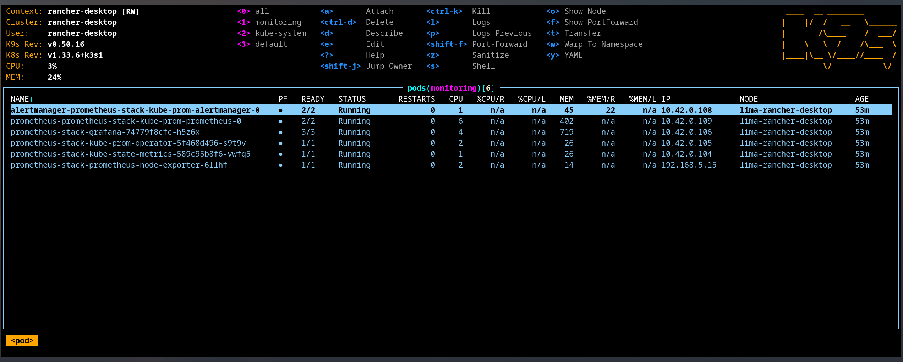

+++
date = '2025-12-27'
title = 'DevOps Part 2 - Starter Projects'
description = 'Practise deploying kubernetes projects'
draft = false
+++

It has been a blast learning Kubernetes. I've been aware of K8s for a long time but found it too complex and overwhelming compared to Docker. However, I now understand why that complexity exists and the problems it solves. I definitely wish i took the leap sooner. 

This article outlines the starter projects I've deployed to solidify my understanding of those principles and fundamentals.

---
## Rancher Desktop Deployment
For testing i went with Rancher Desktop per Mischa's recommendation.
Rancher Desktop is an open-source application that provides all the essentials to work with containers and Kubernetes on the desktop, in addition to providing a GUI and shipping with K3s and it's accompanying defaults (Traefik ingress controller, Flannel CNI, containerd and CoreDNS.) Instead of deploying this in virtual machine on my proxmox host, i decided to deploy on it my beefy desktop PC.


Official documentation doesn't include instructions for arch linux, so i followed the [Installation documentation](https://docs.rancherdesktop.io/getting-started/installation#linux) for setup requirements and adapted them to arch:
Check if user has required permissions for /dev/kvm:
```sh
[ -r /dev/kvm ] && [ -w /dev/kvm ] || echo 'insufficient privileges'
```
Command below adds current user to the "KVM" group:
```sh
sudo usermod -a -G kvm "$USER"
```

Rancher Desktop makes use of Traefik as the default ingress controller. Users may run into a `permission denied` error after deploying Rancher Desktop due to restricted port access on the Traefik ingress. Most Linux distributions do not allow non-root users to listen on TCP and UDP ports below `1024`. In order to allow Traefik to listen to privileged ports on the local host

Adapted persistent config of `sudo sysctl -w net.ipv4.ip_unprivileged_port_start=80` to work with arch linux.
Arch has `/etc/sysctl.d/` directory instead of a `/etc/sysctl.conf` file, created the file below in that directory.
```sh
sudo sh -c 'echo "net.ipv4.ip_unprivileged_port_start=80" >> /etc/sysctl.d/99-rancher-desktop.conf'
# save and apply
sudo sysctl --system
```

Installed rancher desktop, kubectl and k9s using paru:
```sh
paru -S rancher-desktop-bin kubectl k9s
```

## Projects
Below are starter projects i deployed to improve my understanding of Kubernetes Fundamentals and principles

---
### Mealie

[Mealie](https://mealie.io/) is a self hosted recipe manager and meal planner. It frees you from agonising experience of crawling through recipe sites by allowing you to import recipes into it's dashboard.
This is an example on app that doesn't have a helm and needs to be manually configured to deployed via kubernetes.

### App deployment
Taking all the info above to deploy a docker native app with kubernetes:
1. Created blank deployment file with nginx image as the base using `kubectl create deployment` and outputting it to mealie.yaml
2. Replaced nginx name/labels/matchlabels with mealie and added mealie namespace under metadata.
3. Looked up specific docker tags to pull with [documentation](https://docs.mealie.io/documentation/getting-started/installation/installation-checklist/#docker-tags) "ghcr.io/mealie-recipes/mealie:v1.2.0"
4. Apply deployment and use kubectl get pods -o wide and or kubectl describe pods mealie to get IP
5. Port forwarded the mealie pod using `kubectl port-forward pods/mealie 9000` to forward port to localhost or 127.0.0.1:9000 (as long as the terminal is open). `kubectl port-foward -n mealie pods/mealie 9000`
6. Amended mealie version to `ghcr.io/mealie-recipes/mealie:v3.8.0`

```yaml
apiVersion: apps/v1
kind: Deployment
metadata:
  labels:
    app: mealie
  name: mealie
  namespace: mealie
spec:
  replicas: 1 #Default DB doesn't support concurrent write from multiple instances. Might try PSQL later
  selector:
    matchLabels:
      app: mealie
  template:
    metadata:
      labels:
        app: mealie
    spec:
      containers:
      - image: ghcr.io/mealie-recipes/mealie:v1.2.0
        name: mealie
        ports: 
          - containerPort: 9000
```


### Mealie Service Creation
1. Expose mealie deployment which creates a mealie svc. `kubectl expose deployment mealie --port 9000`
2. Port forward mealie service to access on localhost. `kubectl port-forward services/mealie 9000`. Port forward needs to be declared as code to free up shell.
3. Output service config to yaml via `kubectl get svc mealie -o yaml > service.yaml`
```yaml
apiVersion: v1
kind: Service
metadata:
  labels:
    app: mealie
  name: mealie
  namespace: mealie
spec:
  clusterIP: 10.43.209.83
  clusterIPs:
  - 10.43.209.83
  internalTrafficPolicy: Cluster
  ipFamilies:
  - IPv4
  ipFamilyPolicy: SingleStack
  ports:
  - port: 9000
    protocol: TCP
    targetPort: 9000
  selector:
    app: mealie
  sessionAffinity: None
  type: ClusterIP
status:
  loadBalancer: {}
```

Cleaned up output and set type to "LoadBalancer" to expose service via external IP
```yaml
apiVersion: v1
kind: Service
metadata:
  labels:
    app: mealie
  name: mealie
  namespace: mealie
spec:
  ports:
  - port: 9000
    protocol: TCP
    targetPort: 9000
  selector:
    app: mealie
  type: LoadBalancer
```

Output of kubectl get svc after applying, mealie is now accessible via localhost
```bash
kubectl get svc
NAME       TYPE           CLUSTER-IP     EXTERNAL-IP    PORT(S)          AGE
mealie     LoadBalancer   10.43.216.8    192.168.5.15   9000:31940/TCP   4m33s
```


**ALERT!** - Can access the app via localhost:9000 and my external IP 192.168.10.10:9000. But the external IP listed on kubectl get svc is different and doesn't work. Ongoing issue with people on linux in the course, enabling admin access in the rancher app doesn't resolve the issue.
 

### Adding a Persistent Volume
PVC Yaml
```yaml
apiVersion: v1
kind: PersistentVolumeClaim
metadata:
  name: mealie-data-pvc
  namespace: mealie
spec:
  accessModes:
    - ReadWriteOnce
  resources:
    requests:
      storage: 500Mi
```

PV isn't specified and mounted to pod so the status is left at pending
```bash
❯ kubectl get persistentvolumeclaims
NAME          STATUS    VOLUME   CAPACITY   ACCESS MODES   STORAGECLASS   VOLUMEATTRIBUTESCLASS   AGE
mealie-data-pvc   Pending   
```
and no resources can be found via `kubectl get persisentvolume`
```bash
❯ kubectl get persistentvolume
No resources found
```

Added a mealie-data volume pointed to mealie-data-pvc and created a volumeMount for mealie referencing it and /app/data inside the pod.
```yaml
apiVersion: apps/v1
kind: Deployment
metadata:
  labels:
    app: mealie
  name: mealie
  namespace: mealie
spec:
  replicas: 1
  selector:
    matchLabels:
      app: mealie
  template:
    metadata:
      labels:
        app: mealie
    spec:
      containers:
      - image: ghcr.io/mealie-recipes/mealie:v3.8.0
        name: mealie
        ports: 
          - containerPort: 9000
        volumeMounts:
          - mountPath: /app/data
            name: mealie-data
      volumes:
        - name: mealie-data
          persistentVolumeClaim: # PVC Claim in storage.yaml
            claimName: mealie-data-pvc
```
PVC is now bound in `kubectl get persistentvolumeclaims` and `kubectl get persistentvolume`
```bash
❯ kubectl get persistentvolumeclaims
NAME              STATUS   VOLUME                                     CAPACITY   ACCESS MODES   STORAGECLASS   VOLUMEATTRIBUTESCLASS   AGE
mealie-data-pvc   Bound    pvc-a1ff5928-9ae8-478a-b162-173915cf7174   500Mi      RWO            local-path     <unset>                 9m44s
```

```bash
❯ kubectl get persistentvolume
NAME                                       CAPACITY   ACCESS MODES   RECLAIM POLICY   STATUS   CLAIM                    STORAGECLASS   VOLUMEATTRIBUTESCLASS   REASON   AGE
pvc-a1ff5928-9ae8-478a-b162-173915cf7174   500Mi      RWO            Delete           Bound    mealie/mealie-data-pvc   local-path     <unset>                          7m58s
```

Saved Recipe persist after deployment is deleted and recreated


---
### Linkding
[Linkding](https://linkding.link/) is a self hosted bookmark manager, it's another example of an app that doesn't provide a helm chart or installation instructions for kubernetes. So it was more practise for figuring out how configure a docker native app to work with a kubernetes deployment.


Found a tagged docker image[ repo ](https://github.com/sissbruecker/linkding/pkgs/container/linkding)  to use as a reference: `ghcr.io/sissbruecker/linkding:1.44.2-plus-alpine`
Deployed linkding mirroring mealie setup (deployment, namespace and service yaml files):
Deployment.yaml ("Error from server (NotFound): error when creating "deployment.yaml": namespaces "linkding" not found". Fixed after running namespace.yaml first)
```yaml
apiVersion: apps/v1
kind: Deployment
metadata:
  labels:
    app: linkding
  name: linkding
  namespace: linkding
spec:
  replicas: 1 #Default DB doesn't support concurrent write from multiple instances. Might try PSQL later
  selector:
    matchLabels:
      app: linkding
  template:
    metadata:
      labels:
        app: linkding
    spec:
      containers:
      - image: ghcr.io/sissbruecker/linkding:1.44.2-plus-alpine
        name: linkding
        ports: 
          - containerPort: 9090
```

Namespace.yaml
```yaml
apiVersion: v1
kind: Namespace
metadata:
  name: linkding
spec: {}
status: {}
```

Service.yaml
```yaml
apiVersion: v1
kind: Service
metadata:
  labels:
    app: linkding
  name: linkding
  namespace: linkding
spec:
  ports:
  - port: 9090
    protocol: TCP
    targetPort: 9090
  selector:
    app: linkding
  type: LoadBalancer
```

Linkding user setup command is tailored to docker/docker compose install:
```bash
docker exec -it linkding python manage.py createsuperuser --username=joe --email=joe@example.com
```

Converted to work with kubectl
```bash
kubectl exec -it linkding -- /bin/bash
python manage.py createsuperuser --username=test --email=linkding-test@example.com #seperated commands as kubectl treated email flag as unknown
```
![[image-86.png|1280x387]]


**NOTE** - I configured persistent storage later in my homelab repo via Flux CD



---
### Kube Prometheus Stack
The defacto stack for kubernetes monitoring is Prometheus + grafana. This stack is used at the enterprise level to monitor kubernetes
This monitoring stack is responsible for collecting metrics and visualising them. Metrics in this context is data which is used to assess the performance of a status or process i.e CPU/RAM usage, failed processes. This project is deployed via the use of helm charts instead of manually writing manifest.

Installation of traditional helm chart
```bash
 helm repo add prometheus-community https://prometheus-community.github.io/helm-charts
 helm repo update
 helm install prometheus-stack prometheus-community/kube-prometheus-stack --namespace=monitoring --create-namespace
```

Output after installation
```bash
NAME: prometheus-stack
LAST DEPLOYED: Sat Dec 27 00:48:26 2025
NAMESPACE: monitoring
STATUS: deployed
REVISION: 1
NOTES:
kube-prometheus-stack has been installed. Check its status by running:
kubectl --namespace monitoring get pods -l "release=prometheus-stack"

Get Grafana 'admin' user password by running:

kubectl --namespace monitoring get secrets prometheus-stack-grafana -o jsonpath="{.data.admin-password}" | base64 -d ; echo

Access Grafana local instance:

export POD_NAME=$(kubectl --namespace monitoring get pod -l "app.kubernetes.io/name=grafana,app.kubernetes.io/instance=prometheus-stack" -oname)
kubectl --namespace monitoring port-forward $POD_NAME 3000

Get your grafana admin user password by running:

kubectl get secret --namespace monitoring -l app.kubernetes.io/component=admin-secret -o jsonpath="{.items[0].data.admin-password}" | base64 --decode ; echo

Visit https://github.com/prometheus-operator/kube-prometheus for instructions on how to create & configure Alertmanager and Prometheus instances using the Operator.
```



#### Pod Explanations
 - **prometheus-prometheus-stack-kube-prom-prometheus-0** - Collects and store metrics as "time series", meaning the metric are stored with time stamps.The time stamps allow us to see the development of metrics over time. i.e CPU/RAM usage over Days/Weeks/Months

- **alertmanager-prometheus-stack-kube-prom-alertmanager-0** - Used to configure alerts, which an be configured to trigger if specific metrics exceed a specified threshold i.e Node CPU Temps, Storage Space. Has support for a wide range of notification methods full list available [here](https://prometheus.io/docs/alerting/latest/configuration/#file-layout-and-global-settings). Common methods include: Jira, SMTP, Slack, Telegram.

- **prometheus-stack-grafana-74779f8cfc-h5z6x** - Grafana, the component that visualises metrics gathered by Prometheus

- **prometheus-stack-kube-prom-operator-5f468d496-s9t9v** - Simplifies the deployment of Prometheus, it's accompanying resources and configuration of monitoring via [CRDs](https://kubernetes.io/docs/concepts/extend-kubernetes/api-extension/custom-resources/).Allows you to write a simple yaml file called a pod monitor which will monitor all pods with a specific label attached. 

- **prometheus-stack-kube-state-metrics-589c95b8f6-vwfq5** - Listens to the kube api server and generates metrics about the state of objects (such as deployments and Pods) and forwards these metrics to Prometheus.

- **prometheus-stack-prometheus-node-exporter-6llhf** - Agent that runs on all the cluster nodes and collects metrics about their performance.

#### Accessing Grafana Dashboard
The dashboard needs to be exposed using:
```bash
export POD_NAME=$(kubectl --namespace monitoring get pod -l "app.kubernetes.io/name=grafana,app.kubernetes.io/instance=prometheus-stack" -oname)
kubectl --namespace monitoring port-forward $POD_NAME 3000
```

Default values of login credentials would normally be found by exporting values of a helm chart to yaml
```bash
helm show values prometheus-community/kube-prometheus-stack > prometheus-default-values.yaml
```
Unfortunately the "prometheus-default-values.yaml" default "adminPassword" is commented out. 
![[image-52.png|1386x557]]
It could be enabled in a seperate custom-values.yaml (matching original formatting/indentation of course) and injected via:
```bash
helm upgrade prometheus-stack prometheus-community/kube-prometheus-stack --namespace=monitoring --values custom-values.yaml
```

but it is better practise to pull the current value from secrets using the command below as advised by the helm chart earlier.
```bash
kubectl get secret --namespace monitoring -l app.kubernetes.io/component=admin-secret -o jsonpath="{.items[0].data.admin-password}" | base64 --decode ; echo
```
#### Automating port forward
A loadbalancer service needs to be created so a shell kubectl port forward doesn't need to be kept

Used mealie service.yaml as a reference
```yaml
apiVersion: v1
kind: Service
metadata:
  labels:
    app: mealie
  name: mealie-service
  namespace: mealie
spec:
  ports:
  - port: 9000
    protocol: TCP
    targetPort: 9000
  selector:
    app: mealie
  type: LoadBalancer
```
Queried existing prometheus-stack--grafana service for selector
```bash
❯ k get service prometheus-stack-grafana -o wide
NAME                       TYPE        CLUSTER-IP     EXTERNAL-IP   PORT(S)   AGE     SELECTOR
prometheus-stack-grafana   ClusterIP   10.43.173.89   <none>        80/TCP    3h14m   app.kubernetes.io/instance=prometheus-stack,app.kubernetes.io/name=grafana
```
Amended values for prometheus grafana stack, the service contains two selectors `app.kubernetes.io/instance=prometheus-stack` and `app.kubernetes.io/name=grafana`. which need to be separated and formatted in yaml.
```yaml
apiVersion: v1
kind: Service
metadata:
  labels:
    app: grafana
  name: grafana-loadbalancer #name of the service
  namespace: monitoring
spec:
  ports:
  - port: 3000
    protocol: TCP
    targetPort: 3000
  selector:
    app.kubernetes.io/instance: prometheus-stack
    app.kubernetes.io/name: grafana
  type: LoadBalancer
```

Can successfully access the dashboard after applying the file.

**NOTE** - Rancher is still being weird about using the incorrect local machine IP, though exposed services are still available via localhost and my true IP



```bash
❯ k get service grafana-loadbalancer -o wide
NAME                   TYPE           CLUSTER-IP    EXTERNAL-IP    PORT(S)          AGE   SELECTOR
grafana-loadbalancer   LoadBalancer   10.43.66.34   192.168.5.15   3000:32628/TCP   19m   app.kubernetes.io/instance=prometheus-stack,app.kubernetes.io/name=grafana
```


#### Custom Dashboard from mischa
- Imported custom dashboard json file created by [Mischa](https://raw.githubusercontent.com/mischavandenburg/lab/main/kubernetes/grafana/dashboards/simple-namespace-overview.json) . The Dashboard is centered around metrics for namespaces


---
## Next Step
With a basic understanding of kubernetes fundamentals solidified with these projects its time to move on to Gitops.
Once again all of the code for these projects can be found on my Labs repo.



---
## Beats to Listen to


**ALERT!** - Lower your volume, the embedded bandcamp player doesn't have volume controls and it's quite loud by default.


**Amos Roddy - Citizen Sleeper 2 OST**

The story and artstyle of this game already sucks you in, then the music comes in and you never want to leave.
