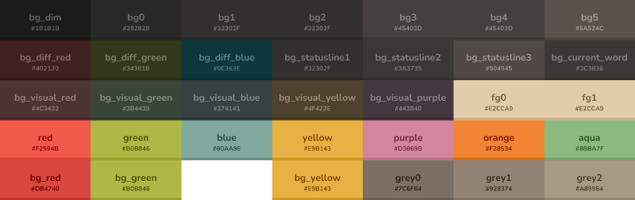
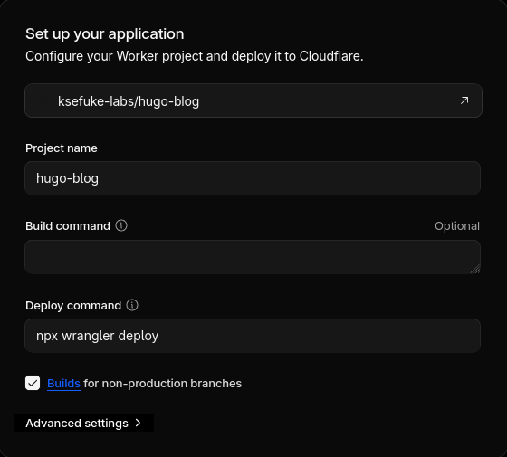
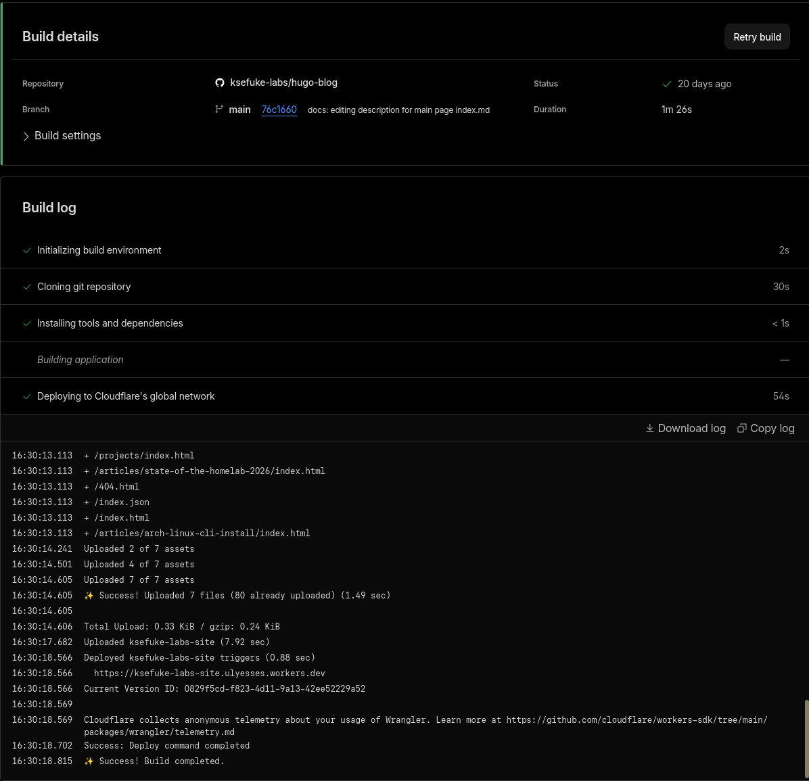
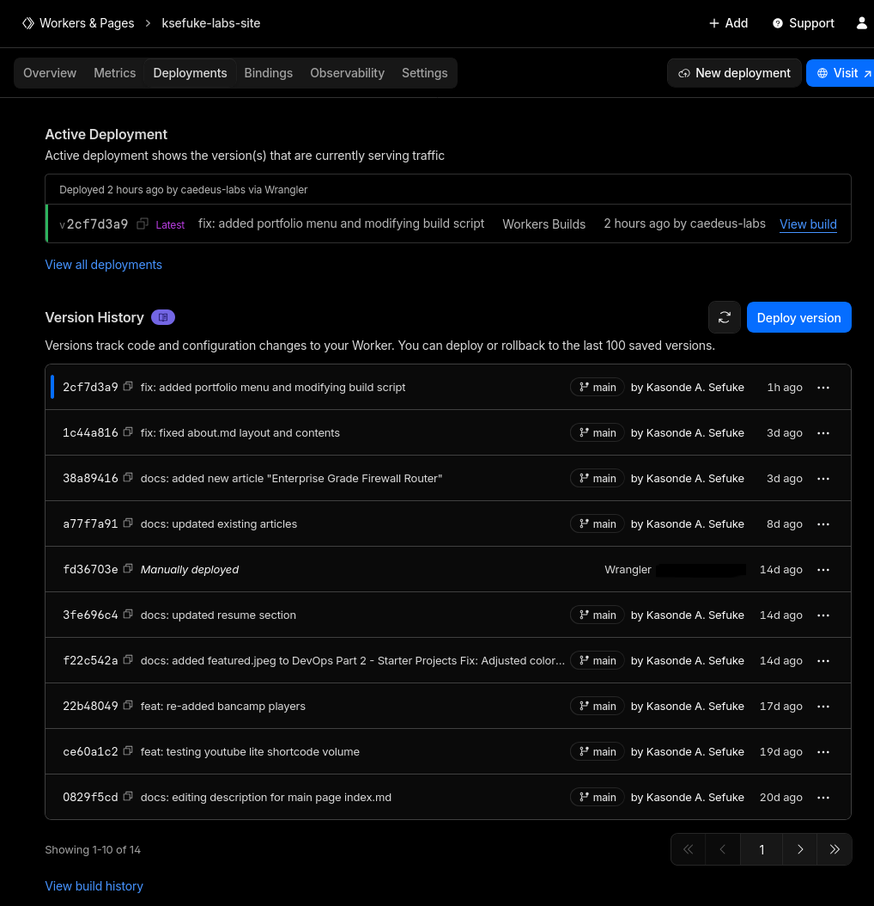
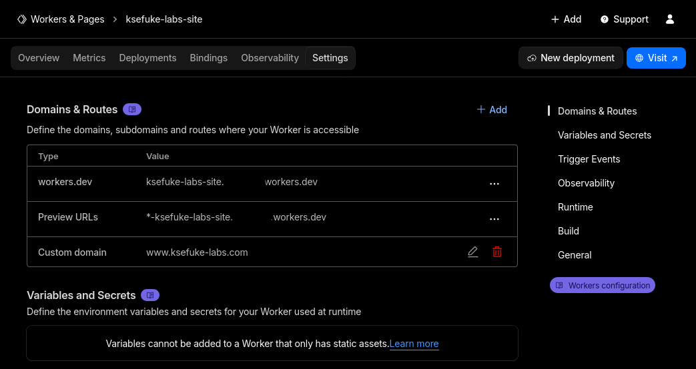

+++
date = '2026-01-06'
title = 'Hugo Site Deployment'
description = 'Building and deploying a personal website with Hugo static site generator, Blowfish theme, and Cloudflare Workers serverless platform.'
draft = false
+++

This article details the process of building and deploying my personal website using Hugo, Blowfish theme, and Cloudflare Workers.

## Why set up a website
The idea of setting up a website has been in the back of my mind for years. I have hundreds of Obsidian notes lying around, documenting ideas, interests and most importantly my suffering dealing with Linux and homelab shenanigans.
What better way to showcase my progress, thought processes and learning than a publicly available portfolio.

## Why Hugo
Since I am not well versed in HTML, I needed something simple to configure and deploy. I choose Hugo, a static site generator that pre-builds websites into HTML/CSS/JS files, eliminating runtime attack surfaces, doesn't require a database or server-side execution so it's vulnerable to code injection, and doesn't have an admin interface to brute force. 

All of these features make it convenient to build a website and not have to stress about security, unlike with WordPress...
Configuration of the site is done in TOML and posts are written in markdown, making it very easy to convert my Obsidian notes into articles.

## Local Development
Hugo is deployed locally on my Cachy OS desktop using the official Hugo pacman package `extra/hugo 0.155.2-1`. I created a GitHub repo to host all the code for the site.

A Hugo site is comprised of several directories:
- **Assets** - Location for raw, unprocessed files, i.e., CSS colour schemes, fonts, profile images
- **Config** - Site configuration files
- **Content** - Location of website content in markdown, i.e., homepage, about me, articles
- **Layouts** - HTML templates that define site structure
- **Public** - Output directory of the final static website, generated upon initialising the Hugo server
- **Resources** - Auto-generated cache
- **Themes** - Location of [pre-made designs](https://themes.gohugo.io/) if applied. Hugo has an expansive list of community-made themes. I decided on [Blowfish](https://blowfish.page/) due to its versatility, frequent updates and extensive documentation. I also wanted to avoid spending time making a custom theme. Blowfish is added as a submodule to my git repo via:
```
git submodule add -b main https://github.com/nunocoracao/blowfish.git themes/blowfish
```


**Note** - Public and Resources directories are included in the .gitignore file. It is unnecessary to store these files in the repo as the site will either be built locally or via other means. More on this later.


Previewing the site locally is done via `hugo server --disableFastRender --noHTTPCache`, which starts a local server without website caching and forces a full site rebuild on every change.

### Site Contents and Features
Below are the site contents and features I use on my website.
Each content type is separated into their own directories for presentation reasons:
```bash
content
├── About # About Me Section (Single File)
├── Articles # Location of primary
├── _index.md # Markdown content for homepage
├── Portfolio # Portfolio Section (Single File)
└── Resume # Resume/CV (Single File, clone of actual resume)
```
#### Custom Colour Scheme
Blowfish provides support for generating a custom CSS colour scheme with the dev's offshoot project called [Fugu](https://github.com/nunocoracao/fugu). But the theme didn't turn out the way I wanted, so I used Claude.AI to modify the custom CSS to my liking. The theme I chose is gruvbox material - mix/medium by [Sainnhe](https://github.com/sainnhe/gruvbox-material). The CSS file is placed in /assets/css/schemes of the root site directory to avoid overwriting files in the blowfish theme assets directory.



<details>

<summary>Gruvbox.css</summary>

```css
/* Gruvbox Material - Mix/Medium/Dark Theme */

:root {
  /* Neutral colors - grayscale progression from bg_dim to fg1 */
  --color-neutral: 226, 204, 169;        /* fg1 - lightest text */
  --color-neutral-50: 216, 186, 138;     /* fg0 */
  --color-neutral-100: 205, 168, 108;    /* orange (secondary-700) */
  --color-neutral-200: 195, 150, 77;     /* darker orange */
  --color-neutral-300: 146, 131, 116;    /* grey1 */
  --color-neutral-400: 124, 111, 100;    /* grey0 */
  --color-neutral-500: 80, 73, 69;       /* bg4 */
  --color-neutral-600: 69, 64, 61;       /* bg3 */
  --color-neutral-700: 50, 48, 47;       /* bg2 */
  --color-neutral-800: 40, 40, 40;       /* bg0 */
  --color-neutral-900: 27, 27, 27;       /* bg_dim */

  /* Primary colors - Yellow/Gold accent */
  --color-primary-50: 252, 230, 194;     /* yellow light variant */
  --color-primary-100: 250, 223, 173;    /* yellow lighter */
  --color-primary-200: 245, 209, 139;    /* yellow light */
  --color-primary-300: 241, 194, 100;    /* yellow */
  --color-primary-400: 233, 177, 67;     /* yellow (Fugu input) */
  --color-primary-500: 229, 162, 30;     /* yellow darker */
  --color-primary-600: 215, 153, 33;     /* bg_yellow */
  --color-primary-700: 196, 137, 23;     /* yellow dark */
  --color-primary-800: 159, 112, 19;     /* yellow darker */
  --color-primary-900: 122, 86, 14;      /* yellow darkest */

  /* Secondary colors - Orange/Warm tones */
  --color-secondary-50: 248, 211, 184;   /* orange light variant */
  --color-secondary-100: 244, 199, 161;  /* orange lighter */
  --color-secondary-200: 240, 187, 138;  /* orange light */
  --color-secondary-300: 236, 175, 115;  /* orange */
  --color-secondary-400: 232, 163, 92;   /* orange medium */
  --color-secondary-500: 226, 204, 169;  /* fg1 (Fugu input) */
  --color-secondary-600: 216, 186, 138;  /* fg0 */
  --color-secondary-700: 205, 168, 108;  /* orange (secondary tone) */
  --color-secondary-800: 195, 150, 77;   /* orange darker */
  --color-secondary-900: 173, 129, 58;   /* orange darkest */

  /* Additional Gruvbox Material colors for UI elements */
  --color-accent-red: 234, 105, 98;      /* red */
  --color-accent-green: 169, 182, 101;   /* green */
  --color-accent-blue: 125, 174, 163;    /* aqua */
  --color-accent-aqua: 139, 187, 127;    /* aqua light variant */
  --color-accent-purple: 211, 134, 155;  /* purple */
  
  /* Background colors */
  --color-bg-dim: 27, 27, 27;
  --color-bg0: 40, 40, 40;
  --color-bg1: 50, 48, 47;
  --color-bg2: 50, 48, 47;
  --color-bg3: 69, 64, 61;
  --color-bg4: 80, 73, 69;
  
  /* Foreground colors */
  --color-fg0: 216, 186, 138;
  --color-fg1: 226, 204, 169;
}

/* Apply dark mode by default */
body {
  background-color: rgb(var(--color-bg0));
  color: rgb(var(--color-fg1));
}

/* Ensure proper contrast for links */
a {
  color: rgb(var(--color-primary-400));
}

a:hover {
  color: rgb(var(--color-primary-300));
}

/* Code blocks styling */
pre, code {
  background-color: rgb(var(--color-bg1));
  color: rgb(var(--color-fg0));
}

/* Selection colors */
::selection {
  background-color: rgb(var(--color-primary-700));
  color: rgb(var(--color-fg1));
}

/* Fix navigation and icons to use fg1 color (#E2CCA9) instead of yellow */
nav a,
nav svg,
.menu a,
.menu svg,
header a,
header svg {
  color: #e2cca9 !important;
}

/* Fix subtitle colors to use grey1 */
.home .text-neutral,
.home .text-neutral-400,
.home .text-neutral-500,
.profile-subtitle,
[class*=subtitle] {
  color: #928374 !important;
}/* Gruvbox Material - Mix/Medium/Dark Theme for Hugo Blowfish v2.94.0 */

:root {
  /* Neutral colors - grayscale progression from bg_dim to fg1 */
  --color-neutral: 226, 204, 169;        /* fg1 - lightest text */
  --color-neutral-50: 216, 186, 138;     /* fg0 */
  --color-neutral-100: 205, 168, 108;    /* orange (secondary-700) */
  --color-neutral-200: 195, 150, 77;     /* darker orange */
  --color-neutral-300: 146, 131, 116;    /* grey1 */
  --color-neutral-400: 124, 111, 100;    /* grey0 */
  --color-neutral-500: 80, 73, 69;       /* bg4 */
  --color-neutral-600: 69, 64, 61;       /* bg3 */
  --color-neutral-700: 50, 48, 47;       /* bg2 */
  --color-neutral-800: 40, 40, 40;       /* bg0 */
  --color-neutral-900: 27, 27, 27;       /* bg_dim */

  /* Primary colors - Yellow/Gold accent */
  --color-primary-50: 252, 230, 194;     /* yellow light variant */
  --color-primary-100: 250, 223, 173;    /* yellow lighter */
  --color-primary-200: 245, 209, 139;    /* yellow light */
  --color-primary-300: 241, 194, 100;    /* yellow */
  --color-primary-400: 233, 177, 67;     /* yellow (Fugu input) */
  --color-primary-500: 229, 162, 30;     /* yellow darker */
  --color-primary-600: 215, 153, 33;     /* bg_yellow */
  --color-primary-700: 196, 137, 23;     /* yellow dark */
  --color-primary-800: 159, 112, 19;     /* yellow darker */
  --color-primary-900: 122, 86, 14;      /* yellow darkest */

  /* Secondary colors - Orange/Warm tones */
  --color-secondary-50: 248, 211, 184;   /* orange light variant */
  --color-secondary-100: 244, 199, 161;  /* orange lighter */
  --color-secondary-200: 240, 187, 138;  /* orange light */
  --color-secondary-300: 236, 175, 115;  /* orange */
  --color-secondary-400: 232, 163, 92;   /* orange medium */
  --color-secondary-500: 226, 204, 169;  /* fg1 (Fugu input) */
  --color-secondary-600: 216, 186, 138;  /* fg0 */
  --color-secondary-700: 205, 168, 108;  /* orange (secondary tone) */
  --color-secondary-800: 195, 150, 77;   /* orange darker */
  --color-secondary-900: 173, 129, 58;   /* orange darkest */

  /* Additional Gruvbox Material colors for UI elements */
  --color-accent-red: 234, 105, 98;      /* red */
  --color-accent-green: 169, 182, 101;   /* green */
  --color-accent-blue: 125, 174, 163;    /* aqua */
  --color-accent-aqua: 139, 187, 127;    /* aqua light variant */
  --color-accent-purple: 211, 134, 155;  /* purple */
  
  /* Background colors */
  --color-bg-dim: 27, 27, 27;
  --color-bg0: 40, 40, 40;
  --color-bg1: 50, 48, 47;
  --color-bg2: 50, 48, 47;
  --color-bg3: 69, 64, 61;
  --color-bg4: 80, 73, 69;
  
  /* Foreground colors */
  --color-fg0: 216, 186, 138;
  --color-fg1: 226, 204, 169;
}

/* Apply dark mode by default */
body {
  background-color: rgb(var(--color-bg0));
  color: rgb(var(--color-fg1));
}

/* Ensure proper contrast for links */
a {
  color: rgb(var(--color-primary-400));
}

a:hover {
  color: rgb(var(--color-primary-300));
}

/* Code blocks styling */
pre, code {
  background-color: rgb(var(--color-bg1));
  color: rgb(var(--color-fg0));
}

/* Selection colors */
::selection {
  background-color: rgb(var(--color-primary-700));
  color: rgb(var(--color-fg1));
}

/* Fix navigation and icons to use fg1 color (#E2CCA9) instead of yellow */
nav a,
nav svg,
.menu a,
.menu svg,
header a,
header svg {
  color: #e2cca9 !important;
}

/* Fix subtitle colors to use grey1 */
.home .text-neutral,
.home .text-neutral-400,
.home .text-neutral-500,
.profile-subtitle,
[class*=subtitle] {
  color: #928374 !important;
}

/* Collapsible code block summary text - Gruvbox yellow */
details summary,
.prose details summary {
  color: rgb(var(--color-primary-400)) !important; /* #E9B143 - Gruvbox yellow */
  font-weight: 600;
}

/* Style the summary element on hover */
details summary:hover,
.prose details summary:hover {
  color: rgb(var(--color-primary-300)) !important; /* Lighter yellow on hover */
  cursor: pointer;
}
```

</details>

#### Shortcodes
A [shortcode](https://gohugo.io/content-management/shortcodes/) is a [_template_](https://gohugo.io/quick-reference/glossary/#template) invoked within markup. They can be used with any content format such as markdown to insert elements such as videos, images, and social media embeds into your content. I'm pretty much only using the custom shortcodes provided by [blowfish](https://blowfish.page/docs/shortcodes/):

- [Alert](https://blowfish.page/docs/shortcodes/#alert) - Outputs its contents as a stylised message box within an article. It's used to draw attention to important information (Volume Warning)
- [Carousel](https://blowfish.page/docs/shortcodes/#carousel) - Used to showcase multiple images in an interactive and visual slideshow. Used to save visual space for mobile readers
- [Github Card](https://blowfish.page/docs/shortcodes/#github-card) - Used to link GitHub repositories with or without repo thumbnails
- [Tabs](https://blowfish.page/docs/shortcodes/#tabs) - Used to present different variants of a particular step. Debating its use as tab headings are easy to miss with the current colour scheme
- [Timeline](https://blowfish.page/docs/shortcodes/#timeline) - A visual timeline that's currently used in my resume showcase
- [TypeIt](https://blowfish.page/docs/shortcodes/#typeit) - JavaScript tool for creating typewriter effects, used to type out the silly quotes on my homepage

#### Custom Bandcamp Shortcode
I also created a custom shortcode for embedding Bandcamp albums/tracks cards by using Claude.ai to modify a custom Spotify shortcode created by [Darthagnon](https://github.com/Darthagnon/darths-hugo-shortcodes/blob/master/layouts/shortcodes/spotify.html).

The HTML file is placed in the /layouts/shortcodes/ root site directory to avoid having to overwrite the contents of the same directory inside the blowfish theme folder.

<details>

<summary>Bandcamp.html</summary>

```html
<!-- Bandcamp shortcode for Hugo
Usage: 
bandcamp media="mediatype" id="1234567890" tracklist="true" artwork="small"
or
bandcamp album 1234567890 true small
bandcamp track 1234567890

Specify supported mediatype: album, track
then get id from Bandcamp embed code (album=XXXXX or track=XXXXX)
Optional parameters:
- tracklist="true" or third parameter "true" to show tracklist (albums only)
- artwork="small|big|only" or fourth parameter to control artwork size:
  - small (default): compact 120px player with small artwork
  - big: large 350px width with big artwork (470px without tracklist, 720px with tracklist)
  - only: artwork only display (350x350px, no player controls)

To find your Bandcamp ID:
1. Go to your album/track on Bandcamp
2. Click "Share / Embed"
3. Look at the embed code for album=XXXXX or track=XXXXX
4. Use that number as your id

Warning: By embedding a Bandcamp player, you agree to Bandcamp's Terms of Service
-->
{{- $media := "" -}}
{{- $id := "" -}}
{{- $showTracklist := false -}}
{{- $artwork := "small" -}}
{{- $height := "120px" -}}
{{- $width := "100%" -}}
{{- $maxWidth := "700px" -}}
{{- if .IsNamedParams -}}
{{- $media = .Get "media" -}}
{{- $id = .Get "id" -}}
{{- if .Get "tracklist" -}}
{{- $showTracklist = true -}}
{{- end -}}
{{- if .Get "artwork" -}}
{{- $artwork = .Get "artwork" -}}
{{- end -}}
{{- else -}}
{{- $media = .Get 0 -}}
{{- $id = .Get 1 -}}
{{- if .Get 2 -}}
{{- $showTracklist = true -}}
{{- end -}}
{{- if .Get 3 -}}
{{- $artwork = .Get 3 -}}
{{- end -}}
{{- end -}}
{{- if eq $artwork "big" -}}
{{- $width = "350px" -}}
{{- $maxWidth = "350px" -}}
{{- if and $showTracklist (eq $media "album") -}}
{{- $height = "720px" -}}
{{- else -}}
{{- $height = "470px" -}}
{{- end -}}
{{- else if eq $artwork "only" -}}
{{- $width = "350px" -}}
{{- $maxWidth = "350px" -}}
{{- $height = "350px" -}}
{{- else -}}
{{- if and $showTracklist (eq $media "album") -}}
{{- $height = "406px" -}}
{{- end -}}
{{- end -}}
{{- $uniqueID := printf "%s-%s-%d" $media $id now.UnixMilli -}}
<div class="embed music-bandcamp" id="bandcamp-{{ $uniqueID }}"><iframe style="border: 0; width: {{ $width }}; max-width: {{ $maxWidth }}; height: {{ $height }}; display: block;" src="https://bandcamp.com/EmbeddedPlayer/{{ $media }}={{ $id }}/size=large/bgcol=333333/linkcol=e99708/{{ if eq $artwork "only" }}minimal=true/{{ else }}{{ if not $showTracklist }}tracklist=false/{{ end }}{{ if eq $artwork "small" }}artwork=small/{{ end }}{{ end }}transparent=true/" seamless allow="autoplay"><a href="https://bandcamp.com">Listen on Bandcamp</a></iframe></div>
{{- if .Site.Params.debug -}}
<script>console.log("Loaded Bandcamp: {{ $media }}/{{ $id }}, tracklist: {{ $showTracklist }}");</script>
{{- end -}}
```

</details>


**Disclaimer!** - I only used Claude.ai to create the Bandcamp shortcode HTML and gruvbox material CSS files for this project. I will rewrite them properly at some point in the future.


---

## Production Deployment
To make the site publicly available, I could have chosen a Docker image from [hugomods](https://hugomods.com/) and deployed it behind nginx proxy manager on my existing Dockerhost Virtual Machine.
However, I decided to try Cloudflare Workers instead. I am in the process of migrating my homelab stack to Kubernetes and wanted to guarantee my website is always online.

[Cloudflare Workers](https://developers.cloudflare.com/workers/) is a serverless platform for building, deploying and scaling apps across Cloudflare's global network. I chose it over GitHub Pages as I already use Cloudflare for all my domains and domain-related API services (Dynamic DNS and Let's Encrypt DNS validation). It has native support for static websites like Hugo.

#### Build Process
The Workers deployment menu allows you to connect your GitHub account to select a repository to pull code from. Once a repo is selected, you will be presented with the menu below:


[Wrangler](https://developers.cloudflare.com/workers/wrangler/) is Cloudflare's Developer Platform CLI, which allows you to manage worker projects. `npx wrangler deploy` is the default deploy command; it needs a config file with build instructions.

**Wrangler.toml**
```toml
name = "ksefuke-labs-site" # Name of project
compatibility_date = "2026-01-16"

[build]
command = "./build.sh" # Bash Script responsible for deploying hugo binary and blowfish theme

[assets]
directory = "./public" # Directory of static assets
not_found_handling = "404-page"
```

The bash script below:
- Downloads and extracts a specific Hugo binary version $HUGO_VERSION
- Updates and initialises the blowfish theme submodule
- Builds the site with minimised HTML, CSS, JSON, JS and XML outputs, reducing their file sizes
- Configures error handling for the script, making it exit if any command fails and if unset variables are present within the script's entire pipeline

**build.sh**

```bash
#!/usr/bin/env bash
main() {
 HUGO_VERSION=0.154.5

 export TZ=Europe/London

 # Install Hugo
 echo "Installing Hugo v${HUGO_VERSION}...."
 curl -LJO https://github.com/gohugoio/hugo/releases/download/v${HUGO_VERSION}/hugo_extended_${HUGO_VERSION}_linux-amd64.tar.gz
 tar -xf "hugo_extended_${HUGO_VERSION}_linux-amd64.tar.gz"
 rm hugo_extended_${HUGO_VERSION}_linux-amd64.tar.gz

 # Verify Installed versions
 echo "Verifying installations"
 echo Go: "$(go version)"
 echo Hugo: "$(hugo version)"
 echo Node.js: "$(node --version)"

 # Clone themes Repo
 echo "Clone Blowfish"
 git submodule update --init --recursive

 # Building the website
 echo "Building the site"
 hugo --gc --minify

}

set -euo pipefail
main "$@"
```

Once deployment is started, Cloudflare displays real-time build logs for troubleshooting, legacy build logs from previous commits and provides a settings section to specify a custom domain.





---

## Future Additions/Plans
This project has been a great learning experience in static site generation and serverless deployments. And it's just the beginning. I plan to make the following amendments at some point:
- Better Music Choice Explantions
- Custom Site Fonts and Icons
- Gruvbox Syntax Highlighting
- Improve Wrangler Build Script
- Inclusion of Other Languages
- Rewrite of Custom Bandcamp Shortcode
- Rewrite of Gruvbox Material Colour Scheme


---
## Beats to Listen to


**ALERT!** - Lower your volume, the embedded Bandcamp player doesn't have volume controls and it's quite loud by default.


**Snail's House - Lumi**

Personal Favourites: **Gemini**, **Lumiukko**, **Frostbite**
