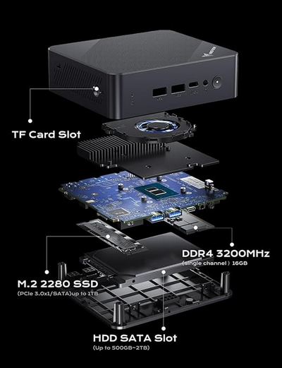
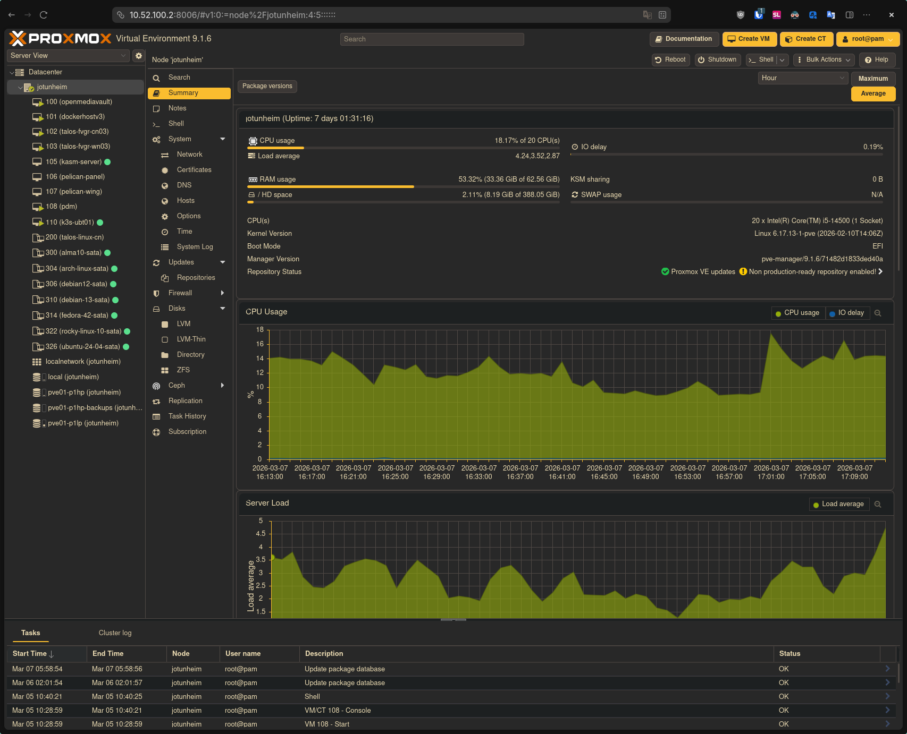
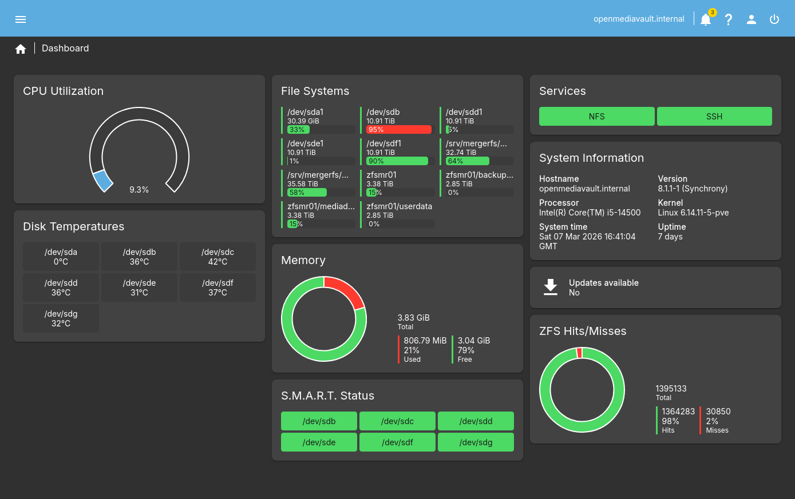
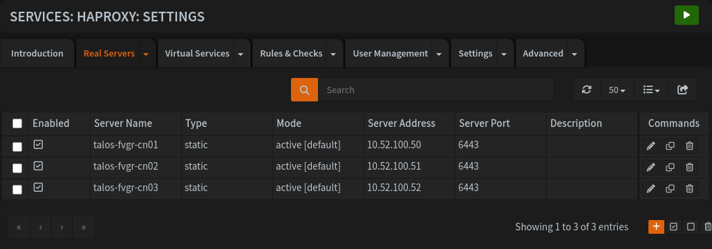
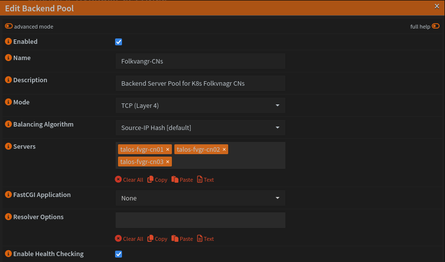
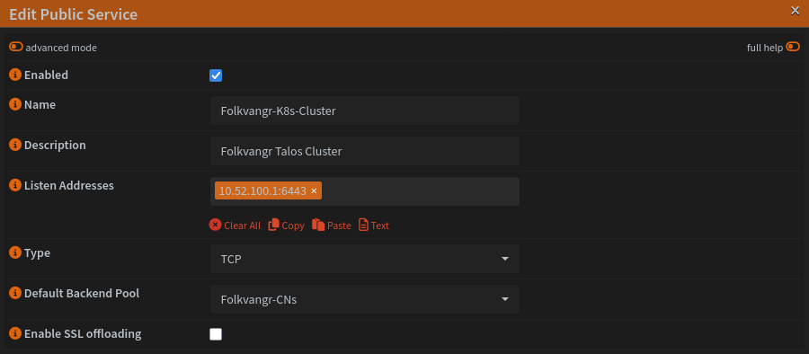

+++
date = '2026-02-27'
#showDateUpdated =
#showPagination =
#showReadingTime =
showTableOfContents = true
#showWordCount =
title = 'Kubernetes Homelab Part 1 - Hardware & Configuration'
description = 'A deep dive into the hardware and configuration behind a multi-cluster Kubernetes homelab, covering Talos Linux, K3s, Rancher Desktop and FluxCD GitOps'
draft = false
+++

This article will go into extensive detail about the hardware powering my kubernetes homelab and the configuration of the individual clusters.
All the code is available on my public Git Repository.



---

## Hardware
All the hardware that make up my homelab in some shape or fashion

### Einherjar | Arch Linux Powered Local Desktop
Einherjar - "Warriors who die in combat every day in Valhalla and are resurrected each evening to feast, repeating this cycle endlessly until Ragnarök". Symbolises the ephemeral nature of my desktop PC consistently being rebuilt. 
This is my local Linux desktop which i built partly for local development.

| Property | Value                        |
| -------- | ---------------------------- |
| OS       | CachyOS                      |
| CPU      | Ryzen 9 7950X3D (16C/32T)    |
| GPU      | AMD Radeon RX 6900 XT (16GB) |
| RAM      | 32GB DDR5                    |
| Storage  | 2TB NVMe                     |

### Hlidskjalf | Enterprise OPNsense Firewall Router
Hlidskjalf is "Odin's high seat from which he surveys all worlds".
OPNsense powers my home network alongside my mikrotik switch. It is responsible for managing NTP, VLANS, DNS, DHCP, IDS/IPS and much [more](https://www.ksefuke-labs.com/articles/enterprise-grade-firewall-router/)). All devices on my home network must communicate with it to access the outside world.

| Property | Value                       |
| -------- | --------------------------- |
| OS       | OPNsense                    |
| Brand    | Topton (Aliexpress)         |
| CPU      | Celeron N5105 (4C/4T)       |
| RAM      | 16GB                        |
| Storage  | 2 × 500GB NVMe (ZFS mirror) |


### Huginn & Muninn | Lower Power NUCs
Huginn and Muninn are Odin's two ravens, his ever watchful eyes. Huginn translates to "Thought" and Muninn translates to "Mind".
These are two Mini PC's purchased back in june 2025 with the intent of deploying kubernetes on them. The Intel 12th Gen Celeron N100 CPU is incredibly power efficient, idling at 6w and maxing out at 25w.


| Property | Value                             |
| -------- | --------------------------------- |
| OS       | Proxmox Virtual Environment (PVE) |
| Brand    | MINISFORUM                        |
| CPU      | Celeron N100 (4C/4T)              |
| iGPU     | Intel UHD Graphics (24 EU)        |
| RAM      | 16GB                              |
| Storage  | 1TB NVMe + 1.92TB SSD             |



### Jotunheim | All in One Proxmox Homelab
Jotunheim refers to the "realm of the giants".
This is my existing all in one homelab featuring a virtualized NAS, Docker VMs and other self host services. More information on it's development, evolution and deployment can be found [here](https://www.ksefuke-labs.com/articles/state-of-homelab-2026/))

| Property | Value                             |
| -------- | --------------------------------- |
| OS       | Proxmox Virtual Environment (PVE) |
| CPU      | i5-14500 (14C/20T)                |
| iGPU     | Intel UHD 770                     |
| RAM      | 64GB DDR4                         |
| Storage  | 2TB NVMe + 960GB SSD              |




### Openmediavault | Virtualized Linux NAS
Virtualized NAS is deployed on **Jotunheim**. It is runnng [Openmediavault](https://www.openmediavault.org/) a next generation NAS solution based on Debian Linux, it supports services like SSH, FTP, SMB, NFS and much [more](https://www.openmediavault.org/features.html).

| Type | Model | Count | Storage | Filesystem | Endurance |
|------|-------|-------|---------|------------|-----------|
| SSD | Transcend SSD470K | 1 | 4TB | ZFS | 9,680 TBW |
| SSD | Kingston DC500R | 1 | 3.84TB | ZFS | 3,504 TBW |
| HDD | Western Digital Red Plus | 2 | 12TB | XFS | 180 TB/year |
| HDD | Ultrastar DC HC520 | 2 | 12TB | XFS | 550 TB/year|

Storage drives above are connected to a HBA SAS pcie card (Flashed to IT [Mode](https://dannyda.com/2021/09/22/what-are-it-mode-hba-mode-raid-mode-in-sas-controllers/) ) on **Jotunheim** which is passed through to the virtual machine via PCIE Passthrough. Emulating a bare metal NAS environment and providing native performance. 

The SSDs are configured as a ZFS Mirror, the HDDs are formatted in XFS and pooled together via mergerfs. The NAS will function as a backup target for kubernetes workload resources and potential as NFS storage.




---
## Repo Structure
Flux CD is my GitOps deployment toolkit of choice.
For simplicity I will be going for a monorepo approach, where you store all your Kubernetes manifests in a single Git repository. The various environments specific configs are all stored in the same branch.  

Each cluster state is defined in a dedicated directory e.g. `clusters/production` where the specific apps and infrastructure overlays are referenced. 
The separation between apps and infrastructure makes it possible to define the order in which a cluster is reconciled, e.g. first the cluster addons and other Kubernetes controllers, then the applications.
```console
├── apps
│   ├── base
│   ├── production 
│   └── staging
├── infrastructure
│   ├── base
│   ├── production 
│   └── staging
└── clusters
    ├── production
    └── staging
```

---
## Development Cluster | Rancher Desktop by SUSE
[Rancher Desktop](https://rancherdesktop.io/) is an open-source application that provides all the essentials to work with containers and Kubernetes on the desktop, in addition to providing a GUI and shipping with K3s and it's accompanying defaults (Traefik ingress controller, Flannel CNI, containerd and CoreDNS.) 

Instead of deploying this in virtual machine on my proxmox host, i decided to deploy on it my local desktop **Einherjar**. It was initially deployed to learn kubernetes via applying manifest manually. But is now used to test docker and kubernetes applications/services of interest

### Configuration
Official documentation doesn't include instructions for arch linux, so i followed the [Installation documentation](https://docs.rancherdesktop.io/getting-started/installation#linux) for setup requirements and adapted them to arch:  
Check if user has required permissions for /dev/kvm:
```sh
[ -r /dev/kvm ] && [ -w /dev/kvm ] || echo 'insufficient privileges'
```

Command below adds current user to the "KVM" group:
```sh
sudo usermod -a -G kvm "$USER"
```

Rancher Desktop makes use of Traefik as the default ingress controller. Users may run into a `permission denied` error after deploying Rancher Desktop due to restricted port access on the Traefik ingress. 

Most Linux distributions do not allow non-root users to listen on TCP and UDP ports below `1024`. In order to allow Traefik to listen to privileged ports on the local host

Adapted persistent config of `sudo sysctl -w net.ipv4.ip_unprivileged_port_start=80` to work with arch linux.  
Arch has `/etc/sysctl.d/` directory instead of a `/etc/sysctl.conf` file, created the file below in that directory.
```sh
sudo sh -c 'echo "net.ipv4.ip_unprivileged_port_start=80" >> /etc/sysctl.d/99-rancher-desktop.conf'
```

Save and apply
```bash
sudo sysctl --system
```

Installed rancher desktop and kubectl using paru:
```sh
paru -S rancher-desktop-bin kubectl
```
---
## Staging Cluster | K3s by Rancher Labs & SUSE
My Staging Cluster is powered by [K3s](https://k3s.io/), a lightweight kubernetes distribution designed with resource constrained IoT & Edge Computing in mind. It ships all required components for a kubernetes cluster. It is deployed as a single-node Ubuntu 24.04 LTS Cloud-Init VM (4 Cores, 8GB RAM) on **Jotunheim** and managed by GitOps via **FluxCD**
- Listens to: `cluster/staging`, `apps/staging` and `infrastructure/staging`.
- Rollback via Proxmox VM snapshots
- Less Painful to break

### Configuration
K3s is installed without the default helm chart and traefik ingress controller, I will be using the helm and traefik controller deployed and managed by Flux CD instead.
```bash
curl -sfL https://get.k3s.io | INSTALL_K3S_EXEC="--disable=helm-controller --disable=traefik" sh 
sudo systemctl status k3s.service
```

Copied K3S.yaml file to .kube/config on my local machine via scp and amended IP to match the remote server
```bash
scp echo@10.52.100.20:/home/echo/k3s.yaml .
mv k3s.yaml ./kube/config
```

Confirmed kubectl loaded correctly and merged the remote K3S context file with my local rancher desktop one.
```bash
flux bootstrap github \
  --token-auth \
  --owner=ksefuke-labs \
  --repository=kubernetes-homelab \
  --branch=main \
  --path=clusters/staging \
  --personal
```

---
## Production Cluster | Talos Linux by Sidero Labs
 **[Talos Linux](https://www.talos.dev)** powers my production cluster alongside **[FluxCD](https://fluxcd.io/)**. It is a secure, immutable and minimalist operating system dealing exclusively for kubernetes:
- No management of underlying OS is required unlike standard deployment on Ubuntu or other distribution.
- It's configuration is entirely declarative, allowing you to define a reproducible desired state via a single YAML file.
- It is entirely API managed, no ssh or config management tools required
- Simple upgrades and fast deployments with rollback support
- Flux CD will be deployed to point to: `clusters/production`, `apps/production`and`infrastructure/production`. Once infrastructure deployment on staging is complete.

### Cluster Layout
After some initial testing i decided to deploy a Talos Linux Cluster with 3 Control Plane nodes and Worker Nodes, with 1 of each deployed type across **Jotunheim**, **Huginn** and **Muninn** PVE servers for High Availability. This allows the cluster to tolerate 1 Control Plane Node going down, in addition to PVE allowing to tear down, rebuild and scale up the cluster without reinstalling the core OS.

**Cluster Name** - Folkvangr (FVGR) the realm of the Goddess Freya, where half of those who die are received. Translates as "field of the host".

**Control Plane Nodes** 

By Default Talos Linux taints control planes nodes so that workloads are not schedulable on them. They will only used to run control plane components.

| Hostname        | IP           | Location  | CPU     | RAM  | Storage |
| --------------- | ------------ | --------- | ------- | ---- | ------- |
| talos-fvgr-cn01 | 10.52.100.50 | Huginn    | 4 Cores | 4GB  | 100GB   |
| talos-fvgr-cn02 | 10.52.100.51 | Muninn    | 4 Cores | 4GB  | 100GB   |
| talos-fvgr-cn03 | 10.52.100.52 | Jotunheim | 4 Cores | 4GB  | 100GB   |

**Worker Nodes**

The plan is to optimise workloads to run **Huginn** and **Muninn** worker nodes and have workloads which require more "horsepower" pinned to the worker node of **Jotunheim**

| Hostname        | IP           | Location  | CPU     | RAM  | Storage |
| --------------- | ------------ | --------- | ------- | ---- | ------- |
| talos-fvgr-wn01 | 10.52.100.55 | Huginn    | 4 Cores | 8GB  | 100GB   |
| talos-fvgr-wn02 | 10.52.100.56 | Muninn    | 4 Cores | 8GB  | 100GB   |
| talos-fvgr-wn03 | 10.52.100.57 | Jotunheim | 4 Cores | 8GB  | 100GB   |


### ISO Config
First step is to get a Talos Linux image from [image factory](https://factory.talos.dev/)
- Bare-metal Machine
- Talos Linux Verstion v1.12.4
- amd64 (No Secure Boot)
- Bootloader: auto
- systemExtensions for Intel CPUs, iGPUs and Longhorn Utilities (more on that later)
```yaml
customization:
    systemExtensions:
        officialExtensions:
            - siderolabs/i915 # Needed for Intel iGPUs
            - siderolabs/intel-ucode # Needed for Intel CPUs (PVE CPU Type is host)
            - siderolabs/iscsi-tools # Needed for Longhorn
            - siderolabs/qemu-guest-agent # Needed for Quest guest agent to work
            - siderolabs/util-linux-tools # Needed for Longhorn
```

### Configuration

**Note!** - I am aware Sidero's Onmi management platform can be used to automate the provisioning of Talos Linux Clusters. But i wanted to gain experience deploying clusters manually and didn't want my Talos Linux Clusters tied to their SaaS Dashboard (Which is £15 per month for 10 nodes or less).


Installed `talosctl` locally using pacman
```
sudo pacman -S talosctl
```

Exported variable exports for automating commands later
```bash
export CONTROL_PLANE_IP=("10.52.100.50" "10.52.100.51" "10.52.100.52")
export WORKER_IP=("10.52.100.55" "10.52.100.56" "10.52.100.57")
export YOUR_ENDPOINT=k8s.folkvangr.internal
export CLUSTER_NAME=Folkvangr
```

Generate the secrets bundle, which is a file that contains all the cryptographic keys, certificates, and tokens needed to secure a Talos Linux cluster.
```bash
talosctl gen secrets -o secrets.yaml  
```

Generate machine configuration using secrets bundle above
```bash
talosctl gen config --with-secrets secrets.yaml $CLUSTER_NAME https://$YOUR_ENDPOINT:6443
```

Apply machine configs for control plane and worker node if applicable
```bash
 for ip in "${CONTROL_PLANE_IP[@]}"; do                         
  echo "=== Applying configuration to node $ip ==="
  talosctl apply-config --insecure \
    --nodes $ip \
    --file controlplane.yaml
  echo "Configuration applied to $ip"
  echo ""
done
```

```bash
 for ip in "${WORKER_IP[@]}"; do                                
  echo "=== Applying configuration to node $ip ==="
  talosctl apply-config --insecure \
    --nodes $ip \
    --file worker.yaml
  echo "Configuration applied to $ip"
  echo ""
done
```

Merged talosconfig into the default configuration file located at `~/.talos/config`:
```bash
talosctl config merge ./talosconfig
```
Set endpoints of your control plane nodes
```bash
talosctl config endpoint $CONTROL_PLANE_IP
```

Bootstrap the cluster
```
talosctl bootstrap --nodes 10.52.100.50
```

Merged new cluster into local kubeconfig
```bash
talosctl kubeconfig --nodes 10.52.100.50
```

<details>

<summary>Output of `talosctl --nodes 10.52.100.50 health`</summary>

```
discovered nodes: ["10.52.100.55" "10.52.100.56" "10.52.100.57" "10.52.100.50" "10.52.100.51" "10.52.100.52"]
waiting for etcd to be healthy: ...
waiting for etcd to be healthy: OK
waiting for etcd members to be consistent across nodes: ...
waiting for etcd members to be consistent across nodes: OK
waiting for etcd members to be control plane nodes: ...
waiting for etcd members to be control plane nodes: OK
waiting for apid to be ready: ...
waiting for apid to be ready: OK
waiting for all nodes memory sizes: ...
waiting for all nodes memory sizes: OK
waiting for all nodes disk sizes: ...
waiting for all nodes disk sizes: OK
waiting for no diagnostics: ...
waiting for no diagnostics: OK
waiting for kubelet to be healthy: ...
waiting for kubelet to be healthy: OK
waiting for all nodes to finish boot sequence: ...
waiting for all nodes to finish boot sequence: OK
waiting for all k8s nodes to report: ...
waiting for all k8s nodes to report: OK
waiting for all control plane static pods to be running: ...
waiting for all control plane static pods to be running: OK
waiting for all control plane components to be ready: ...
waiting for all control plane components to be ready: OK
waiting for all k8s nodes to report ready: ...
waiting for all k8s nodes to report ready: OK
waiting for kube-proxy to report ready: ...
waiting for kube-proxy to report ready: OK
waiting for coredns to report ready: ...
waiting for coredns to report ready: OK
waiting for all k8s nodes to report schedulable: ...
waiting for all k8s nodes to report schedulable: OK
```

</details>

Output of `kubectl get nodes`
```bash
NAME              STATUS   ROLES           AGE     VERSION
talos-fvgr-cn01   Ready    control-plane   8m13s   v1.35.0
talos-fvgr-cn02   Ready    control-plane   8m23s   v1.35.0
talos-fvgr-cn03   Ready    control-plane   8m6s    v1.35.0
talos-fvgr-wn01   Ready    <none>          8m9s    v1.35.0
talos-fvgr-wn02   Ready    <none>          8m23s   v1.35.0
talos-fvgr-wn03   Ready    <none>          8m21s   v1.35.0
```

Flux CD Bootstrap to `clusters/production` , not done yet. Will be bootstrapped when core infrastructure has been deployed and tested on Staging first.
```bash
flux bootstrap github \
  --token-auth \
  --owner=ksefuke-labs \
  --repository=kubernetes-homelab \
  --branch=main \
  --path=clusters/production \
  --personal
```

### Control Plane Load Balancer
Before installation, a load balancer needs to be deployed for Clusters with more than one control plane node so the Kubernetes API server endpoint can reach all control plane nodes, providing true high availability.


**Note!** - If you use Omni to provision your Clusters it will automatically function as a load balancer for your Kubernetes Endpoint.


The could be as simple as setting up Host Override for each control plane node in Unbound DNS on **Hlidskjalf** like below:
```
k8s.folkvangr.internal  IN  A  10.52.100.50
k8s.folkvangr.internal  IN  A  10.52.100.51
k8s.folkvangr.internal  IN  A  10.52.100.52
```

But that's not how we were roll around these parts. So instead I installed HAproxy Plugin on **Hlidskjalf**, created a virtual IP point to `10.52.100.1`. Added the Control Plane Nodes to a backend server pool and mapped the virtual IP as the Public Service listening address `10.52.100.1:6443`. In addition to this I also created a host override for `k8s.folkvangr.internal` pointing to `10.52.100.1` so the Talos endpoint export could resolve correctly.







Output of `curl -k https://k8s.folkvangr.internal:6443` after cluster is deployed.
```bash

{
  "kind": "Status",
  "apiVersion": "v1",
  "metadata": {},
  "status": "Failure",
  "message": "Unauthorized",
  "reason": "Unauthorized",
  "code": 401
}
```

---
## Todo List
- [ ] Configuring PCIE passthrough on Huginn and Muninn PVE servers
- [ ] IGPU passthrough and detection for Production Cluster Worker Nodes
- [ ] Backup tool for control plane nodes
- [ ] Complete testing of base infrastructure on staging cluster

---
