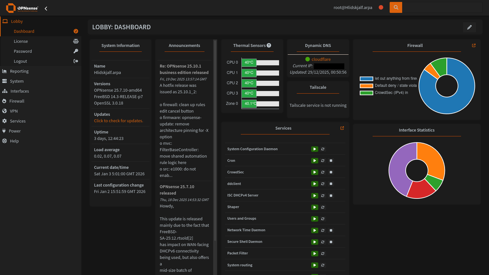
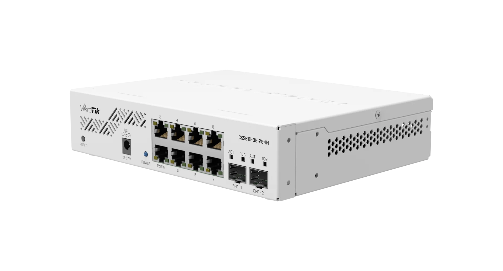
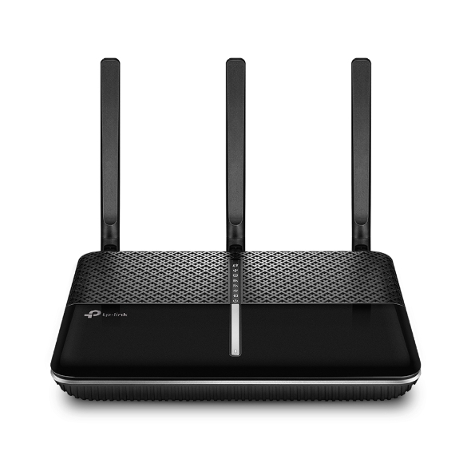

+++
date = '2026-01-26'
title = 'Enterprise Grade Firewall Router'
#description = 'First time installing Arch Linux'
draft = false
+++

A homelab isn't complete without a firewall router. This article documents my journey deploying a enterprise grade firewall router for home network.

---
## The Problem

Once I started experimenting with Proxmox, OpenMediaVault and Docker services back in 2023, I began to notice the limitations of my router. Even with an aftermarket solution such as the [TP-Link AC2100](https://www.tp-link.com/uk/home-networking/dsl-modem-router/archer-vr2100/), issues keeping arising:

- Limited firewall settings besides basic port forwarding
- Only one LAN network range with no VLAN support – so servers, client devices and IoT devices would all be on the same network
- No ability to host a DNS server – reliance on ISP as DNS provider or other DNS providers such as Cloudflare, Google and Quad9
- Limited firmware – poor firmware support even with aftermarket models
- Random dropouts due to low-quality hardware, even among moderately priced aftermarket solutions

I needed a solution that met the following requirements:

- **Extremely configurable** – A solution that grows to meet my needs as they increase
- **Free and open source** – No vendor lock-in and forced subscriptions
- **Network segmentation** – VLANs and advanced firewall rule support for traffic isolation
- **DNS control** – full DHCP/DNS configuration including custom DNS servers and content filtering support
- **Traffic visibility** – Deep packet inspection, logging, and monitoring tools
- **Extensive plugin support** – To provide additional functionality
- **Support for consumer-grade hardware** – Cheap and accessible to get into, doesn't require expensive proprietary hardware
---
## The Solution

A custom-built firewall router. A work colleague mentioned it in passing, but I thought it was an insane idea to actually build one...

After a week or so of research, I decided on [OPNsense](https://opnsense.org/), an open-source, FreeBSD-based firewall and routing platform. It's a fork of pfSense that emerged in 2015, designed to provide a robust, enterprise-grade network security solution with a focus on security, usability, and transparency. It offers comprehensive network security and routing capabilities:

- **Firewall & traffic management** – Stateful packet inspection, network address translation (NAT), traffic shaping and quality of service (QoS), VLAN support, and multi-WAN load balancing with failover
- **VPN capabilities** – Integrated support for IPsec, OpenVPN, WireGuard, and other VPN protocols for secure remote access and site-to-site connections
- **Intrusion detection & prevention** – Built-in IDS/IPS using Suricata for real-time threat detection and blocking malicious traffic
- **DNS configuration** – Support for hosting a wide range of DNS servers such as Unbound DNS, Dnsmasq, OpenDNS and more with plugins
- **Modern interface** – Clean, responsive web interface that's more intuitive than many alternatives, with regular updates and improved user experience design
- **Plugin system** – Extensive plugin architecture allowing easy installation of additional features like HAProxy for load balancing, Nginx for reverse proxy, and various monitoring tools
- **Regular updates** – Follows a predictable release schedule with security patches and feature updates, irrespective of the installed edition (Community vs Business)
- **Extensive support** – OPNsense can be installed on any x86-64 hardware, as long as it meets minimum [hardware requirements](https://docs.opnsense.org/manual/hardware.html)

### What about pfSense?

Despite having experience with pfSense from work and pfSense being the more recognised firewall solution at an enterprise level, I chose OPNsense for the following reasons:
- OPNsense uses the same FreeBSD foundation but with Hardened BSD security enhancements
- It includes many features as standard that require plugins in pfSense, such as intrusion detection/prevention (Suricata), web proxy capabilities, and more granular firewall controls
- OPNsense has a strong focus on open development with public repositories and welcomes community contributions more actively


**Note** - At the time of this project's conception, pfSense didn't have support for i226 NICs in the firewall router I bought.


---
## Hardware

With the operating system decided, it was time to choose hardware.

### Router

Yeah, I bought a firewall router off AliExpress. Now before you shoot me, there were multiple reasons for this.

At the time, if you were looking at making a custom firewall router, firewall routers by Protectli would come up. [Protectli](https://eu.protectli.com/) offer firewall routers with a simple, clean and secure BIOS called [coreboot](https://www.coreboot.org/), an open-source firmware alternative that replaces the proprietary BIOS/UEFI. This is pretty cool and would have been the go-to option if their price vs feature set ratio wasn't so dreadful.

Protectli's entry point [Vault FW2B](https://www.amazon.co.uk/Protectli-Vault-FW2B-Appliance-Compatible/dp/B07G7GW2FB?th=1) ships with an [Intel Celeron J3060](https://www.intel.com/content/www/us/en/products/sku/91534/intel-celeron-processor-j3060-2m-cache-up-to-2-48-ghz/specifications.html) (2 core, 2 thread) CPU, 2 × Intel 1GbE ports and support for up to 8GB of DDR3L RAM and an mSATA SSD slot for £159 (barebone price).

Whereas the [Topton firewall router](https://www.aliexpress.com/item/1005003990581434.html) I purchased ships with an [Intel Celeron N5105](https://www.intel.com/content/www/us/en/products/sku/212328/intel-celeron-processor-n5105-4m-cache-up-to-2-90-ghz/specifications.html) (4 core, 4 thread) CPU, 4 × Intel i226-V 2.5GbE ports, support for 2 × SODIMM DDR4 slots and 2 × M.2 NVMe + 1 × SATA 3.0 slots for £153! Not even a contest, right? 

The final push were ServeTheHome's [articles](https://www.servethehome.com/new-fanless-4x-2-5gbe-intel-n5105-i226-v-firewall-tested/) and [videos](https://youtu.be/xExmvIHEQao) on these specific models, detailing BIOS features, schematics and performance, removing any concerns about the unit's quality and consistency. I did opt for the barebone model so I could purchase more reliable RAM and storage though:

**RAM**: 1 × 16GB Corsair Vengeance SODIMM 16GB DDR4 2666MHz CL18 Memory  
**Storage**: 2 × SK hynix Gold P31 500GB M.2 NVMe SSDs

#### Hosting on old/used hardware?

This is a very valid method of hosting OPNsense. I do have an old B150i motherboard and an Intel i5-6400 lying around, but I wanted something feature-complete, so I didn't have to purchase additional components, i.e. case, power supply, PCIe add-on cards.

#### OPNsense as a virtual machine?

Yeah, no thanks. Hosting OPNsense in a virtual machine would make it easier to scale, make it portable and easier to roll back changes. But virtualisation would have added unnecessary complexity, especially as it would function as the gateway for my network.

### Switch and access point

ISP and aftermarket routers typically act as modems, firewall routers, access points and network switches at the same time. With the introduction of a dedicated firewall router, these roles have to be separated.
I started off with a TP-Link TL-SG108E switch which I purchased back in January 2023 and upgraded to a [MikroTik CSS610-8G-2S+IN](https://mikrotik.com/product/css610_8g_2s_in) in September 2023.
I repurposed my [TP-Link AC2100](https://www.tp-link.com/uk/home-networking/dsl-modem-router/archer-vr2100/) to function as an access point.

### Network cabinet
At the end of 2024 i purchased this [Orion WM1 Wall Mounted Cabinet](https://www.rackcabinets.co.uk/products/wm1-wall-mounted-cabinet?variant=55376318071157) to house my homelab servers and networking equipment.

---
## Network topology

"My Stuff, the homelab and everything else..."
- **LAN 1 (Management)** – Management interface; my desktop PC runs on this network. SSH to router is enabled via passwordless login only. Web GUI is accessible and devices on this network can interact with all devices on other networks. Also functions as a trunk port to MikroTik switch for VLAN 100 (Homelab)
- **LAN 2 (Family)** – Network running all IoT/client devices and access point for the Wi-Fi (TP-Link doesn't have support for VLAN trunking). Web GUI is accessible for emergency reasons, but access to other networks is heavily restricted
- **VLAN 100 (Homelab)** – Network for my homelab; global access is restricted to LAN 1, with devices in LAN 2 only having access to hosted services via HTTPS on my reverse proxy
- **WAN (PPPoE/DHCP)** – Connected to BT ISP via PPPoE, was running behind DHCP of previous router during development. No inbound ports opened excluding DNAT rule for HTTP/HTTPS traffic to reverse proxy. Private networks, bogon networks, SSH and Web GUI access are completely blocked on this interface.

I decided on this topology for its stability and simplicity. I'm still living at home and if the "Wi-Fi" stops working for any reason, I will be blamed. And having too many VLANs would complicate maintenance.

---
## Deployed services

All the services deployed on OPNsense to manage and secure my network.

### CrowdSec IDS/IPS

[CrowdSec](https://www.crowdsec.net/) is an open-source and collaborative security solution offering crowdsourced server detection and protection against malicious IPs. The IDS aspect works by parsing application/appliance logs against specific scenarios such as web GUI and SSH brute-forcing and aggressive port scanning attempts for OPNsense. IPs that trigger these scenarios are banned using a remediation component, i.e. firewall bouncer, which is the IPS aspect of the solution.

Malicious IPs are shared with the CrowdSec community and added to a [community blocklist](https://doc.crowdsec.net/docs/next/central_api/community_blocklist/), which is automatically deployed as IPv4/IPv6 firewall aliases and rules on OPNsense, blocking inbound and outbound traffic to those IPs on all interfaces, with options to integrate additional [blocklists](https://app.crowdsec.net/blocklists) into the aliases.

### Dynamic DNS

A [service](https://docs.opnsense.org/manual/dynamic_dns.html) for automating the process of updating domain registrar DNS records whenever the router WAN IP address changes, which is a common occurrence if the router is restarted. Native support for Cloudflare via a zone API key.

### IPinfo GeoIPs

I have created an allowlist of specific GeoIP aliases attached to a DNAT rule to restrict access to some of the services I have exposed via my reverse proxy. More info on the plugin can be found [here](https://docs.opnsense.org/manual/how-tos/ipinfo_geo_ip.html).

### Q-Feeds

[Q-Feeds](https://qfeeds.com/) is a cyber threat intelligence platform that delivers actionable threat feeds – IPs, domains, URLs, and other indicators of compromise – curated from thousands of sources and updated frequently.
It collects threat data (OSINT + commercial sources) and turns it into structured threat feeds, which are designed to be directly ingested by firewalls, SIEMs, and other security infrastructure. 

This is provisioned via the [OPNsense Q-Feeds connector plugin](https://docs.opnsense.org/manual/qfeeds.html) and free api key from Q-Feeds, which creates a firewall alias and is deployed as rules in the same manners as crowdsec blocklist. Reducing the amount of threats hitting the firewall.

### Tailscale

[Tailscale](https://tailscale.com/) is a secure, peer-to-peer mesh VPN built on WireGuard. It facilitates zero-trust networking, device-to-device encryption and identity-based access without exposing ports.
This is deployed on the firewall router as an exit node, allowing me to route traffic from my phone and laptop through it like a normal VPN when outside the network.

### Unbound DNS

The default DNS server. [Unbound](https://docs.opnsense.org/manual/unbound.html#unbound-dns) is a recursive DNS resolver which provides more secure and authoritative DNS lookups via the root name server; it caches queries locally to improve performance for known domains. It is configured to register DHCP leases and static mappings, with DNS over TLS deployed via Mullvad and Quad9 to encrypt DNS traffic. 

In addition to DNS blocklists (DNSBLs) [Hagezi Multi PRO++](https://github.com/hagezi/dns-blocklists?tab=readme-ov-file#orange_book-multi-pro---maximum-protection-), [threat intelligence feeds](https://github.com/hagezi/dns-blocklists?tab=readme-ov-file#tif), [Dynamic DNS Blocking](https://github.com/hagezi/dns-blocklists?tab=readme-ov-file#tif) and [Badware Hoster](https://github.com/hagezi/dns-blocklists?tab=readme-ov-file#hoster) being deployed to block ads, tracker, telemetry and malicious domains. Unbound DNS
also support host overrides, which i use to forward traffic from my subdomains to my reverse proxy without editting my `/etc/hosts` file on my pc.

---
## Future plans

### 2.5G networking

The router, servers and my desktop PC all have 2.5GbE NICs, but the MikroTik CSS610-8G-2S+IN has gigabit ports and 2 × SFP+ ports. I could use a 10GBase-T RJ45 SFP+ module for 2 connections but would rather put that money into getting a managed 2.5Gb switch. In June 2025, I tried the [MikroTik CRS310-8G+2S+IN](https://mikrotik.com/product/crs310_8g_2s_in) but wasn't happy with the noise it made (even with a Noctua fan swap).

There are cheaper options on the market such as the [SODOLA 9-Port 2.5Gb Switch](https://www.sodola-network.com/products/8-port-2-5gb-web-managed-switch-with-10g-sfp-aluminum-alloy-cooling-magnetic-mounting-lacp-qos-vlan-igmp-managed-multi-gigabit-switch-for-homelab?spm=..collection_099a76ca-e393-464b-8f79-980e7774f06d.collection_detail_1.4&spm_prev=..index.header_1.1), but me being the over-thinker that I am would like to purchase something with future considerations in mind – a "[Buy Once, Cry Once](https://www.youtube.com/watch?v=p8Fa7keyXPU)" situation if you will – which means more than 8 ports and PoE support.

### CrowdSec LAPI migration to Kubernetes cluster

This installation of CrowdSec is running separately from the install on my dockerhost VM. I plan to disable the local API server component on the router and have it parse its logs to a resilient, load-balanced crowdsec deployment on my Kubernetes cluster.

### Dual ISP failover project

A relative purchased a similar AliExpress firewall router in hopes of setting up multi-WAN failover with their Starlink and standard ISP connections, as network outages are quite common in their neighbourhood. They enlisted my help with this project, but I haven't heard back from them since then. I'll be very thorough in documenting the project if it happens.

### OPNsense API interactions with Kubernetes services

It would be interesting to see if [OPNsense's API](https://docs.opnsense.org/development/api.html) can be used in Kubernetes clusters, such as to have Unbound DNS on OPNsense automatically apply host overrides for services/subdomains exposed via ingress controllers.

### OpenWrt access point

I have a NETGEAR WAX220 which I purchased a while back (don't ask how long...) for its OpenWrt support. I would like to deploy it as a dedicated access point with support for VLANs across different SSIDs (Guest, Family, IoT, Management).

### Other planned improvements

- [Static routes with WireGuard for specific traffic](https://schnerring.net/blog/opnsense-baseline-guide-with-vpn-guest-and-vlan-support/)
- Optimisation of firewall rules
- Automatic config backups to USB, GitHub and/or cloud storage
- Automatic restore from backup after update failure
- Suricata deployment

### Rack upgrade

The Orion WM1 was purchased with the limitations of space, price and location in mind. If circumstances allow it (getting my own place), I would definitely upgrade to the [StarTech 4-Post 12U](https://www.startech.com/en-gb/server-management/4postrack12u).

### Router metrics

Exporting router metrics to the Kube Prometheus stack deployment on my production Kubernetes cluster.

### Wazuh agent

As with CrowdSec, I would like to deploy Wazuh SIEM/XDR in a resilient, load-balanced configuration on my Kubernetes cluster and connect OPNsense to it via a [native plugin](https://docs.opnsense.org/manual/wazuh-agent.html).

---
## Beats to Listen to


**ALERT!** - Lower your volume, the embedded bandcamp player doesn't have volume controls and it's quite loud by default


**Upusen - Highland Ave.**

One of my favourite albums to listen to on late drives on the motorway.

**Personal Favorites**: **Halogen Lights**, **INIT**, **Close**, **Delta**, **Escort**, **Celica**
