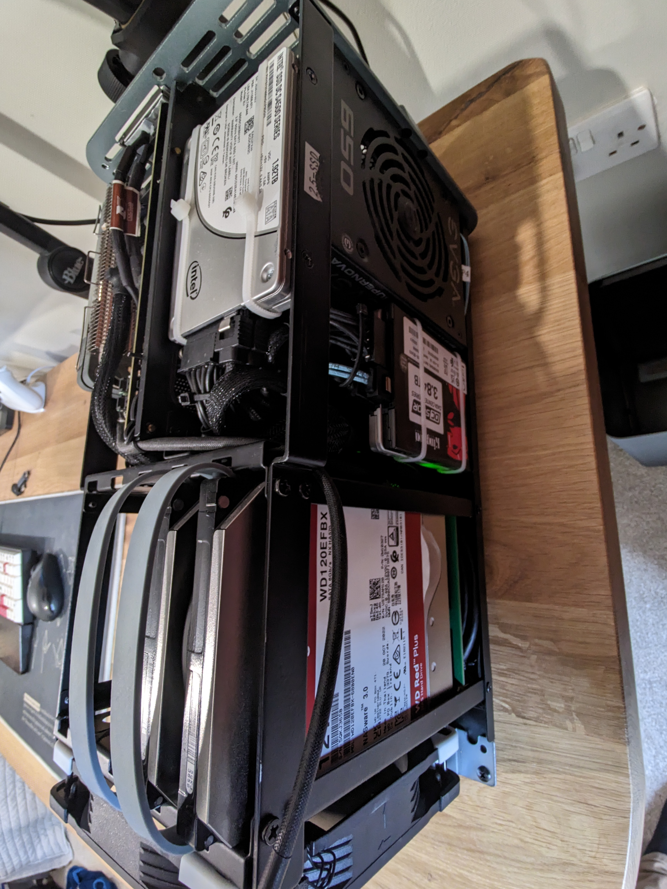

+++
date = '2026-01-01T20:27:30Z'
title = 'State of the Homelab 2026'
description = 'Complete Proxmox homelab build guide: from i5-6400 to i5-14500, featuring OpenMediaVault NAS, ZFS, Mergerfs, and self-hosted services.'
+++

I'm sure you guys have heard the saying "If you stare into the Abyss long enough, the Abyss stares back at you".

Well, the abyss has definitely been staring back. The homelab I've created has certainly grown over the years.
It started off as a means of storing and streaming my purchased music and progressed into something else entirely. 

{{< carousel images="{opnsense-dash.png,pve-dash.png,omv-dash.png,jellyfin-music.png}" interval="3500" >}}

This post details my homelab adventures so far and what's to come in the future.

---
## What started the spiral

I've never been a fan of music streaming services like Spotify as I prefer to own my music and have built up quite a large collection over the years. I also didn't like the idea of storing personal files using cloud storage providers like Google Drive, Microsoft OneDrive and Apple iCloud. 
A Synology NAS was an option but I really wanted to build something myself.

A spectacular video from German YouTuber "[Wolfgang's Channel](https://www.youtube.com/@WolfgangsChannel)" detailing the build process for a custom NAS sparked my [interest](https://www.youtube.com/watch?v=qACTvCW_yDc), but I was turned off due to my lack of understanding of Linux at the time (2021).
It wasn't until I deleted my Windows install and fully migrated to Arch Linux back in 2022 that I decided to revisit the idea again.

---
## Objectives

Me being the over-thinker that I am wanted to identify all of my current requirements and take future requirements into consideration:
- All in one - Wanted to be able to host services in addition to it being a NAS
- Quiet  - Server would live in my room, on my desk so it couldn't be loud
- Power Efficient - Needs to be power efficent, running at less than 100w under load
- Small - Ideally ITX form factor so it's not cumbersome to tinker with or store
- No vendor lock-in or subscriptions - The primary reason for doing this
- Hardware Acceleration Support
- Flexible and cheap to expand/scale

---
## Choice of Operating Systems
To satisfy the "all in one" requirement for my homelab, I could have just installed Ubuntu server edition and left it at that. But me being the chronic tinkerer that I am wanted to be able to break things without having to reinstall the core OS (had already broken several Arch-based installs already at this point).
I stumbled across [Perfect Media Server](https://perfectmediaserver.com/) by Alex Kretzschmar which suggested using Proxmox as the core OS.

[Proxmox VE](https://www.proxmox.com/en/products/proxmox-virtual-environment/overview) is a type 1 hypervisor based on Debian that's free to deploy, has very few limits imposed on users without an Enterprise Subscription and has a fantastic web interface and shell. It can be used to provision traditional virtual machines and Linux containers (LXC).


I do have experience supporting VMware infrastructure in my MSP Cloud Analyst role but didn't consider it an option due to the sheer difference in free feature set (in 2023):

**Proxmox VE:**
- Full clustering capabilities
- High availability
- Live migration
- Backup and restore tools with advanced features (deduplication, compression, incremental backups)
- Both KVM (full virtualisation) and LXC (containers)
- Web-based management interface
- ZFS, LVM, iSCSI, NFS storage support
- No core or memory limitations

**VMware ESXi:**
- Could only run on a limited number of cores and had extremely limited memory
- No vCenter Server access - Centralised panel/dashboard for managing multiple ESXi servers
- No Distributed Resource Scheduler 
- No fault tolerance
- Free Edition completely dropped in 2024 accompanied by significant licensing changes which burned a lot of companies' wallets

---
## Choice of NAS
[OpenMediaVault](https://www.openmediavault.org/) was my go-to NAS option at the time. It's based on Debian under the hood and provided all required services ([Hdparm](https://wiki.archlinux.org/title/Hdparm), NFS, Rsync, SSH, S.M.A.R.T, SMB) out of the box or via [plugins](https://wiki.omv-extras.org/doku.php?id=start) (ZFS Support).

**Note** - I will admit the initial configuration of services and disks can be quite tedious due to the config confirmation nature of OMV. Every change needs to be confirmed/applied and it's in your best interest not to commit multiple changes at once, as a config error may force you to revert them (speaking from experience).


There were other DIY solutions at the time, but these didn't meet my requirements for a number of reasons:
- [Ubuntu Server](https://ubuntu.com/download/server) - I wasn't comfortable manually configuring all backend services at the time and wanted something that just worked so I could start tinkering with services. There are GUI apps such as Red Hat's [Cockpit](https://cockpit-project.org/) and [Webmin](https://webmin.com/) which can be installed on Ubuntu Server, but I found those to be a bit finicky. Obviously now I am aware the CLI is the superior way due to things like scripting and automation.
- [Unraid](https://account.unraid.net/buy) - Requires a licence to use after 30 days. It was also way too web GUI-oriented for my liking. **Note** - There is a fork of Unraid's open-source `md_unraid` kernel driver called [non-raid](https://github.com/qvr/nonraid).
- [TrueNAS](https://www.truenas.com/truenas-community-edition/)' ZFS is a fantastic filesystem, but it requires all the drives to be spun up all the time (see this [post](https://forums.truenas.com/t/hdd-sleep-spindown-standby/13325/120)🙃) which increases power usage by 20W-30W, in addition to requiring purchasing drives in sets to expand available storage depending on the RAID setup.

### Filesystems 
I deployed XFS on my high-capacity NAS hard drives and ZFS on Proxmox boot and VM SSDs, in addition to the NAS SSDs, alongside Mergerfs and Snapraid to combine drive directories.

#### [ZFS](https://wiki.archlinux.org/title/ZFS)
ZFS's copy-on-write design reduces write amplification on SSDs. Its ARC/L2ARC caching, built-in LZ4 compression, and checksumming provide excellent performance and data integrity. TRIM support maintains long-term SSD health.

**Origin:** Created by Sun Microsystems (2005) for Solaris to solve enterprise data integrity and scalability issues. Now maintained as OpenZFS after Oracle's acquisition.

**Enterprise use:** Widely deployed by financial institutions, cloud providers (Netflix), and media companies for databases, VM storage, and mission-critical data requiring snapshots and self-healing.

#### [XFS](https://wiki.archlinux.org/title/XFS)
XFS's allocation group architecture enables parallel access across large HDDs, minimising seek time bottlenecks. Extent-based allocation and delayed writes optimise layout for multi-terabyte files. B-tree directories and online growth make it ideal for massive filesystems.

**Origin:** Developed by SGI (1993) for IRIX to handle extreme demands of 3D graphics and supercomputing. Open-sourced in 2001, became RHEL's default filesystem in 2014.

**Enterprise use:** Standard for scientific computing (CERN), video production studios, backup systems, and cloud object storage backends where large HDDs (10TB+) provide cost-effective cold storage.

#### [Mergerfs](https://github.com/trapexit/mergerfs)
Developed by Antonio SJ Musumeci (trapexit) under ISC licence. Evolved from earlier union filesystems like unionfs and mhddfs to address home storage needs. Used by the Perfect Media Server community, self-hosters, small businesses, and content creators managing large media libraries with mixed drive sizes.

- Logically merges multiple drives into single mount point without striping data
- Each file lives entirely on one disk, so drives remain individually readable
- Drive failure only affects data on that specific drive
- Supports mixed drive sizes and different filesystems
- Flexible policies control data distribution across drives
- Simple configuration with one line in `/etc/fstab` (example below)
```txt
/mnt/disk* /mnt/storage fuse.mergerfs defaults,nonempty,allow_other,use_ino,cache.files=off,moveonenospc=true,category.create=mfs,dropcacheonclose=true,minfreespace=250G,fsname=mergerfs 0 0
```


#### [Snapraid](https://www.snapraid.it/)
Developed by amadvance under GPLv3. Active since early 2010s with ongoing updates. Cross-platform support for Linux, Windows, macOS, BSD, Solaris. Targeted at media centres with large static files. Standard solution in self-hosted community, used by content creators and small production studios as alternative to unRAID and traditional RAID.
- Can be used alongside Mergerfs to provide some redundancy
- Stores parity for recovery from up to six disk failures
- Non-real-time: manual backup execution required (not live RAID)
- Works with existing data without reformatting
- Hashes all data for integrity verification
- Supports mixed drive sizes, add drives anytime
- Lower power consumption (only accessed disks spin up)


#### [NFS](https://wiki.archlinux.org/title/NFS)
NFS over Samba for file shares was a no-brainer as I am literally the only person in the household that has a PC (which is on Linux). NFS also has native integration with Docker volumes.


#### PCIe Passthrough
Did I forget to mention the NAS was virtualised? While researching Proxmox I discovered you can pass through [PCIe devices](https://pve.proxmox.com/wiki/PCI(e)_Passthrough) into VMs so they appear as native devices.
The idea of leaving the NAS disk exposed on Proxmox and provisioning block storage from them to be virtualised on OMV felt gross and I wanted near-native performance from OMV.

The code block below contains the setup process for systems using systemd-boot:

<details>
<summary>Show code</summary>

```bash
# 1. Confirm VT-d (Intel) or AMD-Vi (AMD) is available/enabled in the bios for IOMMU support.

# 2. Configure kernel command line for IOMMU
echo "intel_iommu=on iommu=pt" > /etc/kernel/cmdline

# 3. Configure required VFIO modules
cat > /etc/modules << 'EOF'
vfio
vfio_iommu_type1
vfio_pci
vfio_virqfd
EOF

# Verify VFIP Modules are loaded
lsmod | grep vfio
# Confirm IOMMU is enabled via 
dmesg | grep -e DMAR -e IOMMU
# Identify PCI IDS/drivers using LSPCI
lspci -nnk
# 3. Configure VFIO PCI IDs and blacklist conflicting drivers
cat > /etc/modprobe.d/pve-blacklist.conf << 'EOF'
options vfio-pci ids=1000:0072,8086:4690
blacklist mpt3sas
blacklist i915
EOF

# 4. Apply changes
proxmox-boot-tool refresh && update-initramfs -u -k all
```
</details>

Once this is done the driver in use should change to "**vfio-pci**".
LSI HBA SAS Controller:
```bash
01:00.0 RAID bus controller [0104]: Broadcom / LSI SAS2008 PCI-Express Fusion-MPT SAS-2 [Falcon] [1000:0072] (rev 03)
        Subsystem: Fujitsu Technology Solutions HBA Ctrl SAS 6G 0/1 [D2607] [1734:1177]
        Kernel driver in use: vfio-pci
        Kernel modules: mpt3sas
```

```bash
00:02.0 VGA compatible controller [0300]: Intel Corporation AlderLake-S GT1 [8086:4680] (rev 0c)
        Subsystem: ASRock Incorporation Device [1849:4680]
        Kernel driver in use: vfio-pci
        Kernel modules: i915, xe
```


## Progression of hardware
The slippery slope that is purchasing parts you don't need because you look at eBay too much.

"Just a little more" I said, "I don't need it" I said...



    
    
At the start I made use of several components I had lying around from my first PC build and purchased everything else,
as a means of testing the waters before making further investments.

This phase consisted of testing Proxmox and deciding on a filesystem for the NAS HDDs (more on this later).


| **CPU**          | [Intel Core i5-6400](https://www.intel.com/content/www/us/en/products/sku/88185/intel-core-i56400-processor-6m-cache-up-to-3-30-ghz/specifications.html)                                                                                                                                                                                                                                                                                                                                                                                         |
| ---------------- | ------------------------------------------------------------------------------------------------------------------------------------------------------------------------------------------------------------------------------------------------------------------------------------------------------------------------------------------------------------------------------------------------------------------------------------------------------------------------------------------------------------------------------------------------- |
| **Cooler**       | Cryorig C7                                                                                                                                                                                                                                                                                                                                                                                                                                                                                                                                        |
| **Motherboard**  | [MSI B150I Gaming PRO AC](https://www.msi.com/Motherboard/B150I-GAMING-PRO-AC/Specification)                                                                                                                                                                                                                                                                                                                                                                                                                                                      |
| **Memory**       | 2 x 8 GB DDR4-2400 CL16                                                                                                                                                                                                                                                                                                                                                                                                                                                                                                                           |
| **Case**         | [Jonsbo n1](https://www.jonsbo.com/en/products/N1.html)                                                                                                                                                                                                                                                                                                                                                                                                                                                                                           |
| **Power Supply** | [EVGA SuperNOVA 650 G1+](https://www.evga.com/Products/Specs/PSU.aspx?pn=9D224A7D-D321-4350-A2FA-C8366DF799A4)                                                                                                                                                                                                                                                                                                                                                                                                                                    |
| **Boot Drive**   | [2 TB Seagate Firacuda NVMe 520](https://www.seagate.com/gb/en/support/internal-hard-drives/ssd/firecuda-520-ssd/?sku=ZP1000GV3A012#Specs)                                                                                                                                                                                                                                                                                                                                                                                                        |
| **NAS Storage**  | 2 x [12 TB Western Digital Red Plus HDD](https://www.westerndigital.com/en-gb/products/internal-drives/data-center-drives/ultrastar-dc-hc520-hdd?sku=0F30146)+ 1 TB Seagate Barracuda HDD                                                                                                                                                                                                                                                                                                                                                        |
| **Network**      | 1GbE Realtek® RTL8111H NIC                                                                                                                                                                                                                                                                                                                                                                                                                                                                                                                        |
| **Add-on Cards** | [LSI HBA PCIe 2.0 SAS Card (IT mode)](https://www.ebay.co.uk/itm/395725433717?_skw=LSI+HBA+PCIe+2.0+SAS+Card&itmmeta=01KE7RZR9PHDMF9XHX6Y11Z4ZJ&hash=item5c2312eb75:g:CKwAAOSw1K5m9A~I&itmprp=enc%3AAQAKAAAA0FkggFvd1GGDu0w3yXCmi1dfZLVW%2FMU%2B0aQFjNdHW6J3Q37tXEqncIUbJe%2FEAk8YWXJE2QTXZa%2BzrgZXeCHq8vuixFXsFfLba6Wm05TyQg0QvNwfi918iIfgHdm%2FKtRQYDCc%2BG6gDXsbWpl4%2Fhl8%2B79n8c2s%2FYoFCGKU0lXIdtnSLtZDDPcVf5IROkl3yS3BHe6fXgPm5fZXI%2BejfEk4BgzeYiHtr1a2FgpBVM6rNCzyjB8Bd2beZoN5KJox9ycdTSJ8GxBzlFvQRK0RRpo22WQ%3D\|tkp%3ABk9SR46F__jxZg) |
    
    
        

    
At this point I had established the workflow I wanted and discovered the wonders of eBay. This is when the server really started kicking off:
- Stronger CPU with better hardware acceleration and increased core count while staying under 35W
- Motherboard to support new CPU
- 2 x 32GB of DDR4 because there was a deal for 40 pounds and I couldn't help myself 🤣
- Kingston SSD was also an impulsive purchase



| **CPU**                     | [Intel Core i5-12500T](https://www.intel.com/content/www/us/en/products/sku/96140/intel-core-i512500t-processor-18m-cache-up-to-4-40-ghz/specifications.html)                                                                                                                                                                                                                                                                                                                                                                                     |
| --------------------------- | ------------------------------------------------------------------------------------------------------------------------------------------------------------------------------------------------------------------------------------------------------------------------------------------------------------------------------------------------------------------------------------------------------------------------------------------------------------------------------------------------------------------------------------------------- |
| **CPU Cooler**              | [Thermalright AXP120-X67](https://www.thermalright.com/)                                                                                                                                                                                                                                                                                                                                                                                                                                                                                          |
| **Motherboard**             | [ASRock Z690 ITX](https://www.asrock.com/mb/Intel/Z690M-ITXax/)                                                                                                                                                                                                                                                                                                                                                                                                                                                                                   |
| **Memory**                  | 2 x 32GB DDR4 3200MHz CL22                                                                                                                                                                                                                                                                                                                                                                                                                                                                                                                        |
| **Case**                    | [Jonsbo n1](https://www.jonsbo.com/en/products/N1.html)                                                                                                                                                                                                                                                                                                                                                                                                                                                                                           |
| **Boot Drive + VM Storage** | 2 x [1.92TB Intel S4500 SSDs](https://lenovopress.lenovo.com/lp0755-intel-s4500-entry-sata-6gb-ssds)                                                                                                                                                                                                                                                                                                                                                                                                                                              |
| **NAS Storage**             | 2 x [12TB Western Digital Red Plus HDD](https://www.westerndigital.com/en-gb/products/internal-drives/data-center-drives/ultrastar-dc-hc520-hdd?sku=0F30146)<br>1 x [3.84TB Kingston DC500R SSD](https://www.kingston.com/datasheets/DC500R_us.pdf)<br>1 x 1TB Seagate Barracuda HDD                                                                                                                                                                                                                                                             |
| **Network**                 | 2.5 GbE Realtek NIC + 1GbE Intel I219V NIC                                                                                                                                                                                                                                                                                                                                                                                                                                                                                                        |
| **Add-on Cards**            | [LSI HBA PCIe 2.0 SAS Card (IT mode)](https://www.ebay.co.uk/itm/395725433717?_skw=LSI+HBA+PCIe+2.0+SAS+Card&itmmeta=01KE7RZR9PHDMF9XHX6Y11Z4ZJ&hash=item5c2312eb75:g:CKwAAOSw1K5m9A~I&itmprp=enc%3AAQAKAAAA0FkggFvd1GGDu0w3yXCmi1dfZLVW%2FMU%2B0aQFjNdHW6J3Q37tXEqncIUbJe%2FEAk8YWXJE2QTXZa%2BzrgZXeCHq8vuixFXsFfLba6Wm05TyQg0QvNwfi918iIfgHdm%2FKtRQYDCc%2BG6gDXsbWpl4%2Fhl8%2B79n8c2s%2FYoFCGKU0lXIdtnSLtZDDPcVf5IROkl3yS3BHe6fXgPm5fZXI%2BejfEk4BgzeYiHtr1a2FgpBVM6rNCzyjB8Bd2beZoN5KJox9ycdTSJ8GxBzlFvQRK0RRpo22WQ%3D\|tkp%3ABk9SR46F__jxZg) |
    

    
So, a few things changed at this point if you couldn't tell (ignore the networking equipment, that deserves its own post 😜):
- Wolfgang's video on network rack got me interested and a cheap used RM21-308 was available on Amazon
- I discovered bargain hardware and made 2 HDD purchases
- Found another deal on a 4TB SSD in March 2025 to mirror with my Kingston one
- Separated boot, low and high-speed disk to accommodate different workloads and make restoring Proxmox easier
- Beefier CPU for heavier workloads, i.e., Windows Server 2025 dev environment, game server hosting


| **CPU**          | [Intel Core i5-14500](https://www.intel.com/content/www/us/en/products/sku/236784/intel-core-i5-processor-14500-24m-cache-up-to-5-00-ghz/specifications.html)                                                                                                                                                                                                                                                                                                                                                                                     |
| ---------------- | ------------------------------------------------------------------------------------------------------------------------------------------------------------------------------------------------------------------------------------------------------------------------------------------------------------------------------------------------------------------------------------------------------------------------------------------------------------------------------------------------------------------------------------------------- |
| **CPU Cooler**   | [Thermalright AXP120-X67](https://www.thermalright.com/)                                                                                                                                                                                                                                                                                                                                                                                                                                                                                          |
| **Motherboard**  | [ASRock Z690 ITX](https://www.asrock.com/mb/Intel/Z690M-ITXax/)                                                                                                                                                                                                                                                                                                                                                                                                                                                                                   |
| **Memory**       | 2 x 32GB DDR4 3200MHz CL22                                                                                                                                                                                                                                                                                                                                                                                                                                                                                                                        |
| **Case**         | [Silverstone RM21-308](https://www.silverstonetek.com/en/product/info/server-nas/RM21-308/)                                                                                                                                                                                                                                                                                                                                                                                                                                                       |
| **Boot Drive**   | 1 x [480GB Intel S3510 SSD](https://lenovopress.lenovo.com/lp0056-s3510-enterprise-entry-sata-ssds)                                                                                                                                                                                                                                                                                                                                                                                                                                               |
| **VM Storage**   | [2 TB Seagate Firacuda NVMe 520](https://www.seagate.com/gb/en/support/internal-hard-drives/ssd/firecuda-520-ssd/?sku=ZP1000GV3A012#Specs) + 960GB Intel S4500 SSD                                                                                                                                                                                                                                                                                                                                                                                |
| **NAS Storage**  | 1 x [4TB Transcend SSD470K SSD](https://www.transcend-info.com/embedded/product/embedded-ssd-solutions/ssd470k-ssd470k-i)<br>1 x [3.84TB Kingston DC500R SSD](https://www.kingston.com/datasheets/DC500R_us.pdf)<br>2 x [12TB Western Digital Red Plus HDDs](https://www.westerndigital.com/en-gb/products/internal-drives/wd-red-plus-sata-3-5-hdd?sku=WD120EFGX)<br>2 x [12TB Ultrastar DC HC520 HDDs](https://www.westerndigital.com/en-gb/products/internal-drives/data-center-drives/ultrastar-dc-hc520-hdd?sku=0F30146)                     |
| **Network**      | 2.5 GbE Realtek NIC + 1GbE Intel I219V NIC                                                                                                                                                                                                                                                                                                                                                                                                                                                                                                        |
| **Add-on Cards** | [LSI HBA PCIe 2.0 SAS Card (IT mode)](https://www.ebay.co.uk/itm/395725433717?_skw=LSI+HBA+PCIe+2.0+SAS+Card&itmmeta=01KE7RZR9PHDMF9XHX6Y11Z4ZJ&hash=item5c2312eb75:g:CKwAAOSw1K5m9A~I&itmprp=enc%3AAQAKAAAA0FkggFvd1GGDu0w3yXCmi1dfZLVW%2FMU%2B0aQFjNdHW6J3Q37tXEqncIUbJe%2FEAk8YWXJE2QTXZa%2BzrgZXeCHq8vuixFXsFfLba6Wm05TyQg0QvNwfi918iIfgHdm%2FKtRQYDCc%2BG6gDXsbWpl4%2Fhl8%2B79n8c2s%2FYoFCGKU0lXIdtnSLtZDDPcVf5IROkl3yS3BHe6fXgPm5fZXI%2BejfEk4BgzeYiHtr1a2FgpBVM6rNCzyjB8Bd2beZoN5KJox9ycdTSJ8GxBzlFvQRK0RRpo22WQ%3D\|tkp%3ABk9SR46F__jxZg) |

And......2 mini PCs from eBay with the same specs in June 2025 (the deals were too good to pass).

| **PC**              | [MINISFORUM UN100P](https://www.minisforum.com/products/minisforum-un100p-1)                                    |
| ------------------- | --------------------------------------------------------------------------------------------------------------- |
| **Memory**          | 1 x 16GB DDR4 3200MHz SODIMM                                                                                    |
| **Boot + VM Drive** | 1 x [Intel S4500 1.92TB SSD](https://lenovopress.lenoso.com/lp0755-intel-s4500-entry-sata-6gb-ssds)             |
| **VM Storage**      | 1 x [1TB IronWolf 525](https://www.seagate.com/gb/en/support/internal-hard-drives/nas-drives/ironwolf-525-ssd/) |
| **Network**         | 2.5 GbE NIC                                                                                                     |

    

    
    i5-6400 vs i5-12500T vs Celeron N100 vs i5-14500


		


----

## Services
The services I'm currently running or have run over the years:

- **[CrowdSec](https://www.crowdsec.net/)**: Collaborative security engine detecting and blocking threats across multiple servers - Deployment is limited to firewall router at the moment, but I will be deploying it in Kubernetes to function as a log and decision aggregator for all servers going forward.
- **[Home Assistant](https://www.home-assistant.io/)**: Open-source platform for controlling smart home devices from one interface - Not in use at the moment.
- **[Hugo Webserver](https://gohugo.io/)**: Fast static site generator for building websites - Decommissioned in favour of local deployment.
- **[Immich](https://immich.app/)**: Self-hosted photo/video backup solution similar to Google Photos.
- **[Jellyfin](https://jellyfin.org/)**: Open-source media server for streaming your media library - Used for streaming my music files.
- **[Kasm Workspaces](https://www.kasmweb.com/)**: Container-based platform streaming isolated browser/desktop environments via web - A very cool project that I believe can compete with Citrix and function as a gateway into desktop Linux at the enterprise level.
- **[LinuxGSM](https://linuxgsm.com/)**: Command-line tool for deploying and managing game servers on Linux - Decommissioned in favour of Pelican Panel.
- **[Navidrome](https://www.navidrome.org/)**: Lightweight music streaming server compatible with Subsonic clients - Decommissioned in favour of Jellyfin's nicer feature set.
- **[Nginx Proxy Manager Plus](https://github.com/ZoeyVid/NPMplus)**: Reverse proxy manager with web UI and CrowdSec bouncer support.
- **[Obsidian Livesync (via CouchDB)](https://github.com/vrtmrz/obsidian-livesync)**: Self-hosted sync solution for Obsidian notes using CouchDB - Not in use at the moment.
- **[Pelican Panel](https://pelican.dev/)**: Modern game server management panel, successor to Pterodactyl.
- **[Portainer](https://www.portainer.io/)**: Web-based Docker management interface for containers - Rarely use this as I deploy my containers entirely via Docker Compose in the CLI.
- **[Pterodactyl](https://pterodactyl.io/)**: Open-source game server management panel with user-friendly interface - Decommissioned in favour of Pelican Panel.
- **[Tailscale](https://tailscale.com/)**: Zero-config VPN creating secure connections using WireGuard.
- **[Technitium DNS](https://technitium.com/dns/)**: Self-hosted DNS server with ad-blocking and advanced features - Not in use at the moment as Unbound on my firewall router is my primary DNS.
- **[Vikunja](https://vikunja.io/)**: Open-source to-do list and project management application - Not in use at the moment, would like to combine with my Obsidian workflow at some point.
- **[Wazuh SIEM](https://wazuh.com/)**: Security platform for threat detection, compliance, and incident response - Still in testing, this will get the same treatment as CrowdSec and will be deployed across all my servers (and hopefully desktops).
---

  
## Future Improvements

**Dedicated Hardware for Bare-metal NAS**
Running a NAS as a virtual machine has proven to be quite stable and flexible. But I would love to move it to dedicated hardware at some point. There is something about the setup that makes me feel like it's a snake eating its own tail, especially as it isn't helpful if I have to switch off the Proxmox node for maintenance. Considering getting another 2U chassis and moving Proxmox to that instead?

**Kubernetes on spare mini PCs**
I honestly haven't touched the 2 Minisforum N100D mini PCs I bought back in June besides installing Proxmox on them. I bought them with the initial idea of clustering them and messing with ZFS/Ceph replication. But I decided against it as I didn't have enough services to warrant spreading them out. Now with my migration to Kubernetes from Docker underway, I plan to install K3s or Talos Linux on them directly and cluster them.

---
## Beats to Listen to


**ALERT!** - Lower your volume, the embedded Bandcamp player doesn't have volume controls and it's quite loud by default.


**Slowerpace - Learning Time**

Reminds me of those old school safari documentary intros.
