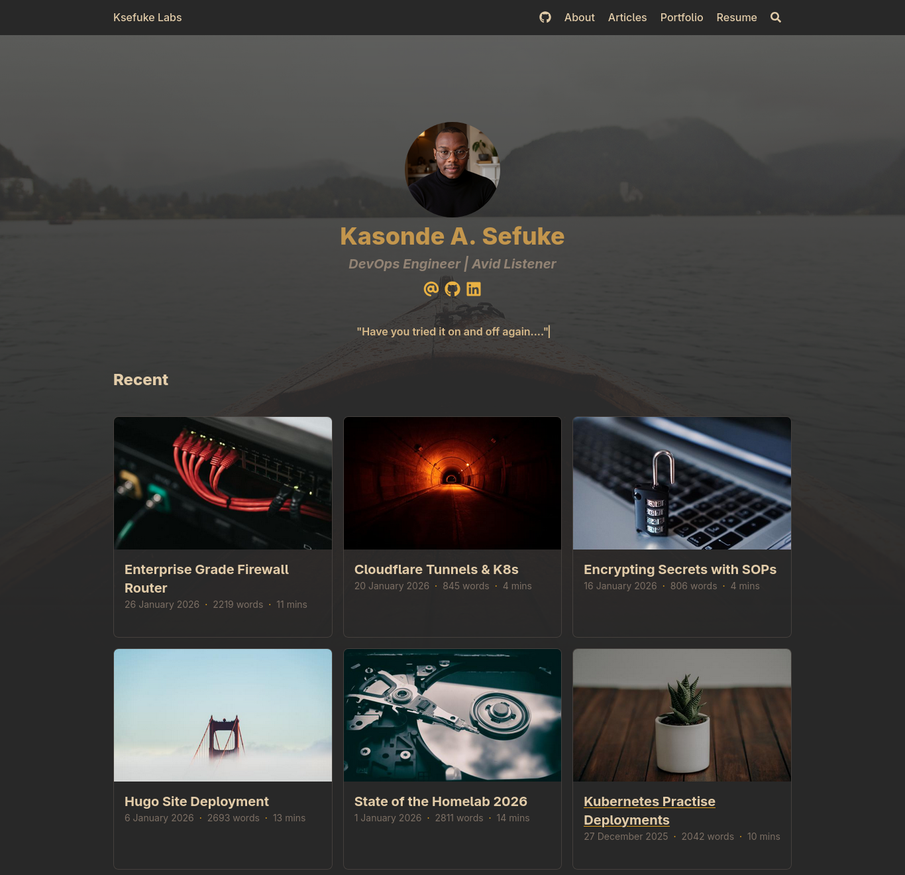
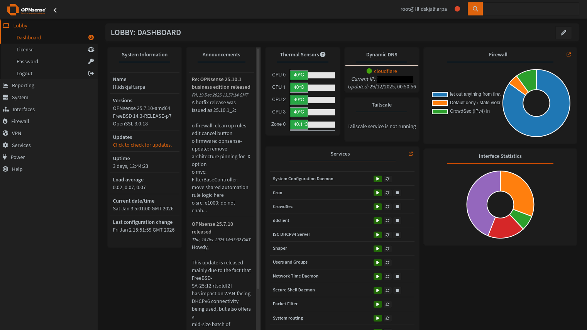
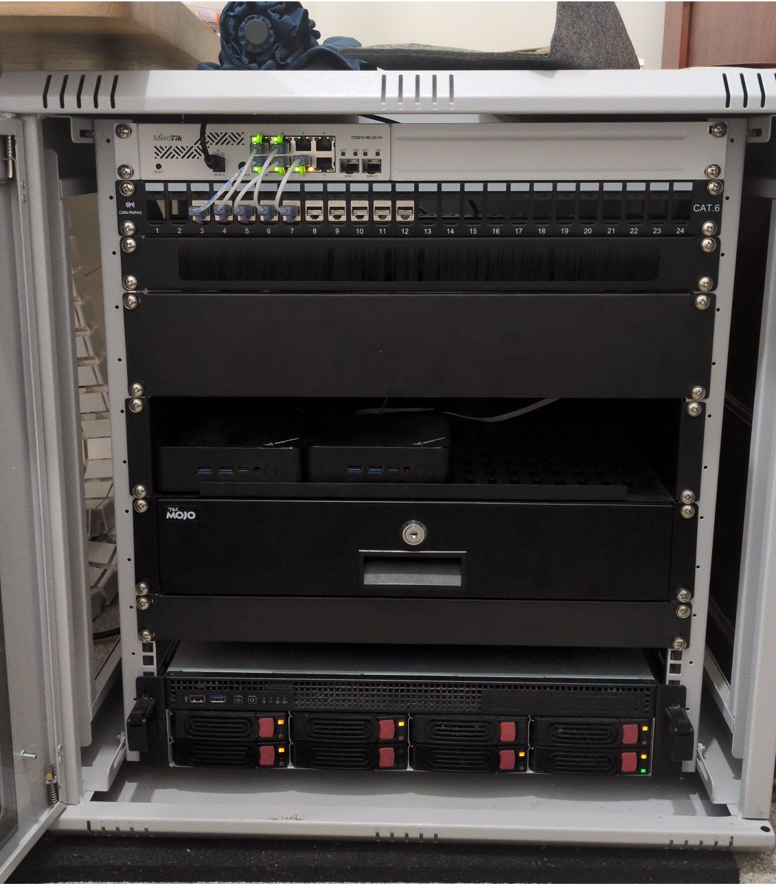

+++
draft = false
title = 'Portfolio'
layout = 'simple'
+++

---
## Kubernetes Homelab 
`Jan 2026 - Present Day`

[ksefuke-labs/kubernetes-homelab](https://github.com/ksefuke-labs/kubernetes-homelab)

Designed and deployed a production-grade Kubernetes homelab environment using Talos Linux, K3s, and Proxmox — with the Talos Linux and K3s clusters managed through GitOps principles with FluxCD.
The infrastructure spans a 3-cluster architecture across Development, Staging, and Production, with a focus on high availability, resilient storage, and security.
Key highlights:

- **Development** — Applications and projects of interest are tested and deployed manually via manifest files using Rancher Desktop on my local desktop
- **Staging** — Single node K3s cluster managed by FluxCD for iterating on applications before promoting to production
- **Production** — Talos Linux powered cluster managed with FluxCD, consisting of 3 control plane nodes and 3 worker nodes deployed across Proxmox servers Jotunheim, Huginn and Muninn, with control nodes load balanced via HAProxy
- **Longhorn** - Highly available persistent storage using longhorn with backups synced to a 32TB OpenMediaVault NAS via NFS
- **Encrypted secret management** - Secrets encrypted using SOPS
- **Monitoring** - Full observability stack via Kube Prometheus Stack with Grafana dashboards
- **Renovate** - Automated dependency management
- **Networking** - Networking stack featuring MetalLB, Traefik Ingress, Cloudflare Tunnels, and Cert-manager

Actively expanding with planned additions including Cilium to replace Flannel and MetalLB, PostgreSQL migrations, self-hosted AI leveraging iGPU acceleration, Wazuh XDR/SIEM and CrowdSec as a security suite, and Kasm Workspaces for VDI.

---

## Serverless Hugo Deployment
`January 2026 - Febuary 2026`

[ksefuke-labs/hugo-blog](https://github.com/ksefuke-labs/hugo-blog) | [Hugo Site Deployment](https://www.ksefuke-labs.com/articles/hugo-site-deployment/)

This very website built to showcase progress, thought processes and learning from years of Obsidian notes documenting ideas, interests and homelab shenanigans.
Built using Hugo, a static site generator that pre-builds websites into HTML/CSS/JS files, eliminating runtime attack surfaces without requiring a database or server-side execution, making it convenient to build a website without having to stress about security. The site is themed with Blowfish, chosen for its versatility, frequent updates and extensive documentation, configured in TOML and written in markdown.

Deployed to Cloudflare Workers, a serverless platform for building, deploying and scaling apps across Cloudflare's global network, chosen to guarantee the website is always online and independent of the homelab infrastructure. The build process is automated via a Wrangler configuration and a bash script that downloads a pinned Hugo binary, initialises the Blowfish theme submodule, and builds the site with minified HTML, CSS, JSON, JS and XML outputs. Deployments are triggered automatically on commits to the connected GitHub repository.
Developed locally on CachyOS using the official Hugo pacman package, with live preview via a local development server forcing a full site rebuild on every change.

---

## OPNsense - Enterprise Grade Firewall Router
`May 2023 - Present Day`

[Enterprise Grade Firewall Router](https://www.ksefuke-labs.com/articles/enterprise-grade-firewall-router/)

Frustrated by the limitations of consumer-grade routers — no VLAN support, no DNS control, random dropouts, and locked-down firmware — I decided to build a custom firewall router from scratch.
The setup:
I deployed OPNsense (an open-source, FreeBSD-based firewall platform) on a Topton mini PC with an Intel Celeron N5105, 4× Intel i226-V 2.5GbE ports, 16GB DDR4, and dual NVMe SSDs — all for under £160. The network runs through a MikroTik managed switch and a repurposed TP-Link access point, housed in a wall-mounted network cabinet.
What I built and configured:

- CrowdSec IDS/IPS — crowdsourced threat detection with automated IP blocking across all interfaces
- GeoIP allowlisting — restricting access to exposed services by geography
- Q-Feeds threat intelligence — ingesting curated IOC feeds directly into firewall rules
- Tailscale VPN — WireGuard-based mesh VPN for secure remote access via the router as an exit node
- Unbound DNS — recursive DNS resolver with DNS-over-TLS, DHCP integration, and ad/malware blocklists (Hagezi Multi PRO++)
- Dynamic DNS — automated domain record updates on WAN IP changes
- Network segmentation — isolated VLANs for management, homelab, and family/IoT traffic with granular firewall rules

---
## Proxmox - All in one Homelab
`December 2022 - Present Day`

[State of the Homelab 2026](https://www.ksefuke-labs.com/articles/state-of-homelab-2026/)

A self-hosted homelab built to eliminate reliance on cloud storage providers and music streaming services, with a focus on data ownership, power efficiency, and extensibility.
Deployed Proxmox VE as a type 1 hypervisor for its full clustering capabilities, live migration, and advanced backup tools — provisioning both KVM virtual machines and LXC containers without core or memory limitations.
The NAS runs as a virtualised OpenMediaVault instance with PCIe passthrough of an LSI HBA SAS controller for near-native disk performance. 

Storage is configured with ZFS on SSDs for its copy-on-write design, ARC caching, built-in compression, and checksumming, and XFS on high-capacity HDDs for its parallel access architecture and optimised handling of multi-terabyte files. Mergerfs logically combines drives into a single mount point while keeping each file entirely on one disk, with Snapraid providing parity-based redundancy across mixed drive sizes — all within an ITX form factor running under 100W.

Currently running services including Immich for photo and video backup, Jellyfin for media streaming, Kasm Workspaces for containerised browser and desktop environments, Pelican Panel for game server management, Nginx Proxy Manager as a reverse proxy, Tailscale for zero-config WireGuard VPN, and Wazuh SIEM for threat detection and incident response.
Migrating from Docker to Kubernetes, with plans to deploy K3s or Talos Linux on clustered mini PCs and expand CrowdSec and Wazuh into resilient, load-balanced deployments across all servers.

---
